<!-- markdownlint-disable MD045 -->

# Pose estimation with SLEAP {#sec-sleap}

Before we proceed, make sure you have installed [SLEAP v1.6.3](https://docs.sleap.ai/v1.6.3/installation/) [@pereira_sleap_2022] and activated the corresponding `conda` environment (see [prerequisites @sec-install-sleap]).
You will also need to download the [CalMS21 dataset](https://sites.google.com/view/computational-behavior/our-datasets/calms21-dataset) [@sun_caltech_2021] video file `mouse044_task1_annotator1.mp4` from [Dropbox](https://www.dropbox.com/scl/fo/81ug5hoy9msc7v7bteqa0/AH32RLdbZqWZJstIeR4YHZY?rlkey=blgagtaizw8aac5areja6h7q1&st=w1zueyi9&dl=0) (see [prerequisites @sec-data] for details on the folder contents).

## Single-animal vs multi-animal pose estimation

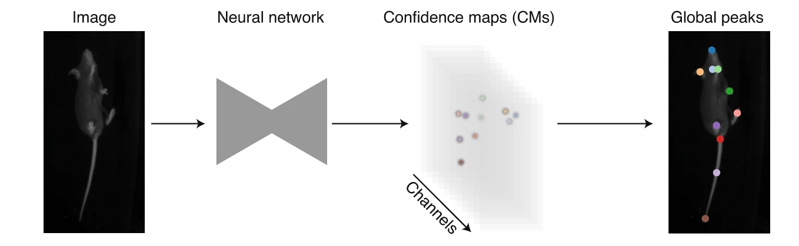{width=100%}

**Single-animal pose estimation** focuses on detecting keypoints for one animal per frame, which is considered a landmark-localisation task where each body part has a unique coordinate.
This approach is simpler and faster to train and run.

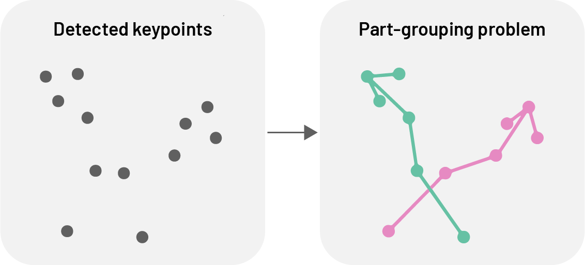{fig-align="center" width="80%"}

**Multi-animal pose estimation** aims to detect and track multiple animals simultaneously within the same frame.
This is essential for studying social behaviours, group dynamics, or any scenario where animals interact, as it addresses the unique challenges of assigning detections reliably to individuals both within an image (part-grouping problem) and across frames (identity-tracking problem).

## Top-down vs bottom-up approaches

For multi-animal pose estimation, SLEAP offers both top-down and bottom-up approaches.

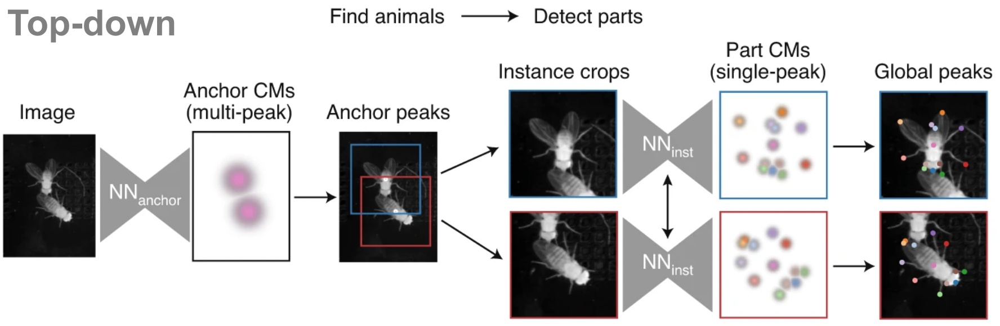{width=100%}

**Top-down approaches** use **two models** in sequence.
First, an anchor detection model (e.g. a centroid model) locates each animal in the frame.
Then, for each detected animal, a pose estimation model processes an anchor-centred crop to predict confidence maps for the body parts of the centred animal.

This approach typically yields more accurate pose estimates and is well-suited to datasets with few animals.
As the second stage of the network runs once per animal, inference speed scales linearly with the number of animals.

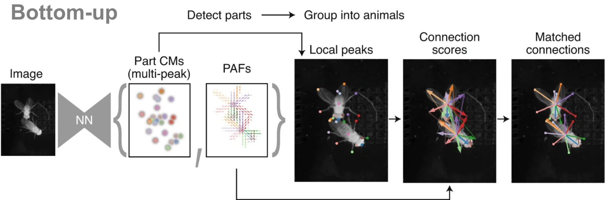{width=100%}

**Bottom-up approaches** use a **single model** that processes the entire frame in a single pass.
This model outputs confidence maps for all body parts in the image, along with Part Affinity Fields (PAFs)—vector fields that represent spatial relationships between parts and are used to group them into individual animal instances.

Due to their single-stage construction, bottom-up models scale efficiently with increasing numbers of animals and are particularly effective in crowded or high-occupancy scenes.

## Identity tracking approaches

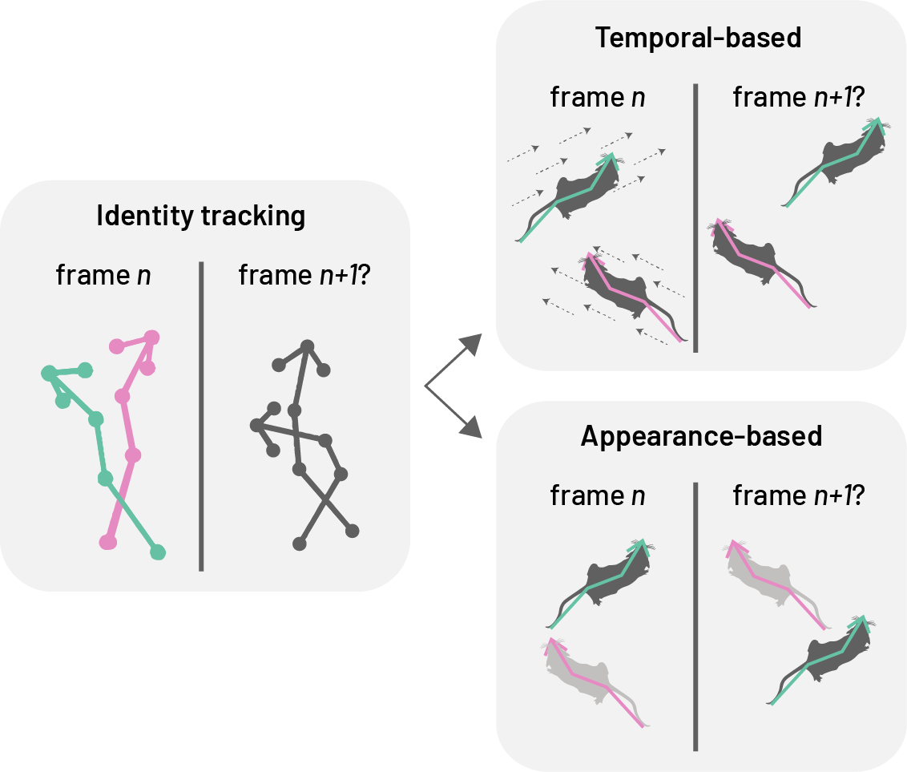{fig-align="center" width="80%"}

SLEAP addresses the challenge of maintaining consistent animal identities across frames using two primary strategies: **temporal-based** and **appearance-based** cues.

**Temporal-based tracking** uses optical flow to estimate pose displacement across frames, associating past with current poses without requiring model training.
This makes it well-suited for animals that are visually similar, as it avoids the need to label consecutive frames.
However, errors, such as identity switches, can accumulate and propagate, limiting its reliability in long videos or real-time settings where post-hoc correction is not feasible.

**Appearance-based tracking (ID models)** assigns identities based on visual features while simultaneously detecting and grouping landmarks.
This approach mitigates error propagation but relies on animals having distinguishable visual traits that allow manual identification during labelling.

- **Top-down ID models** extend the centered-instance network to predict class probabilities for each animal-centred crop.
- **Bottom-up ID models** replace PAFs with multi-class segmentation maps, collapsing body part masks into separate channels for each unique class ID. Grouping is implicit in the ID assignment.

## Resident–intruder assay

The resident–intruder assay [@jove4367] is a behavioural test used to study social interactions, especially aggression and territoriality, in rodents. A resident mouse, habituated to its home cage, is confronted with an unfamiliar intruder, and their interactions—such as chasing, attacking, or investigating—are observed and quantified. This assay is widely used in neuroscience to explore the neural and genetic basis of social behaviour.

## Dataset

In this tutorial, we will use [SLEAP](https://sleap.ai/) to train a **multi-animal top-down identity model** to simultaneously perform pose estimation and identity tracking of two mice in a short video (`mouse044_task1_annotator1.mp4`) from the [CalMS21 dataset](https://sites.google.com/view/computational-behavior/our-datasets/calms21-dataset).

This video captures a brief interaction between two mice in a resident–intruder assay, where the black mouse (the resident), implanted with a
head-mounted microendoscope, has established territory and the white mouse (the intruder) is newly introduced into the resident's cage.

## SLEAP workflow

::: {.callout-note}
The workflow described here closely follows the [official SLEAP tutorial](https://docs.sleap.ai/latest/tutorial/overview/), adapted to our dataset. Refer to the official docs for additional details and alternative workflows.
:::

```{mermaid}
graph LR
    videos("Videos<br>(1,2,...,n)") --> |extract| frames[/Sampled<br>frames/]
    frames --> |"label<br>body parts<br>and ID"| labels[/Training<br>dataset/]
    labels --> |train| model[/Model/]

    videos --> test[/Unseen<br>frames/]
    test --> model
    model --> |infer| predictions[/Predictions/]
    
    predictions --> |fix labels<br>and merge| labels
```

A typical SLEAP workflow for multi-animal pose estimation and identity tracking consists of the following key steps:

1. **Create project**: Start a new SLEAP project and import your video(s).
2. **Define skeleton**: Create a `Skeleton` that defines the `Nodes` (each representing a keypoint or body part of interest, e.g. nose, left ear, right ear) and `Edges` (each representing the connections between keypoints, e.g. nose–left ear, nose–right ear) for the animals to be tracked.
3. **Sample frames**: Extract frames from your video(s) to create a set of frames for annotation.
4. **Label frames**: Annotate the sampled frames by marking the body parts and assigning identities (`Tracks`) to each animal. These labelled frames together form the training dataset.
5. **Train model**: Use the training dataset to train a pose estimation and identity tracking model.
6. **Predict on new data**: Apply the trained model to new, unlabelled video frames to generate pose and identity predictions for each animal.
7. **Proofread predictions**: Review and correct the predictions as needed.
8. **Refine model**: Corrected predictions can be merged back into the training dataset to retrain the model as needed.

### Create a new project

Activate the `sleap` environment and launch the SLEAP GUI.

```bash
conda activate sleap
sleap
```

Add a video by navigating to the "Videos" panel and clicking on "Add Videos" (or go to "File" → "Add Videos").
Since the video is in greyscale, enable the "Grayscale" option in the video import dialogue.
This ensures SLEAP processes the input as a single-channel image, which can improve performance and reduce memory usage for greyscale videos.
Further details can be found in [SLEAP's Import videos guide](https://docs.sleap.ai/latest/tutorial/importing-data/#import-videos-into-sleap).

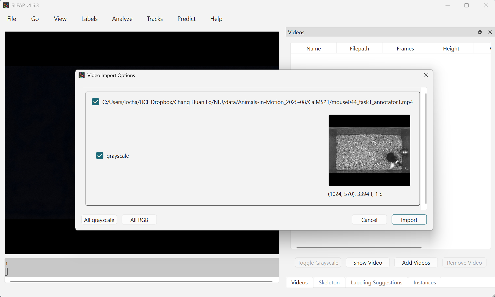{width=100%}

### Define skeleton

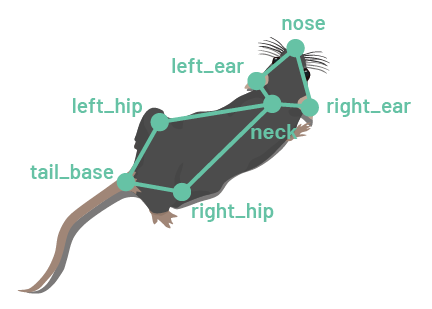{fig-align="center" width="40%"}

In SLEAP, `Skeletons` are defined as a set of `Nodes` (body parts or keypoints of interest) and `Edges` (connections between body parts or keypoints).
With the exception of bottom-up models, `Edges` serve primarily for visualisation.

Switch to the `Skeleton` panel and add `Nodes` for each body part of interest, e.g.:

- `nose`
- `right_ear`
- `left_ear`
- `neck`
- `right_hip`
- `left_hip`
- `tail_base`

Then, define the `Edges` to connect the `Nodes` using the drop-down menus, e.g.:

- `nose`–`left_ear`
- `nose`–`right_ear`
- `left_ear`–`neck`
- `right_ear`–`neck`
- `neck`–`left_hip`
- `neck`–`right_hip`
- `left_hip`–`tail_base`
- `right_hip`–`tail_base`

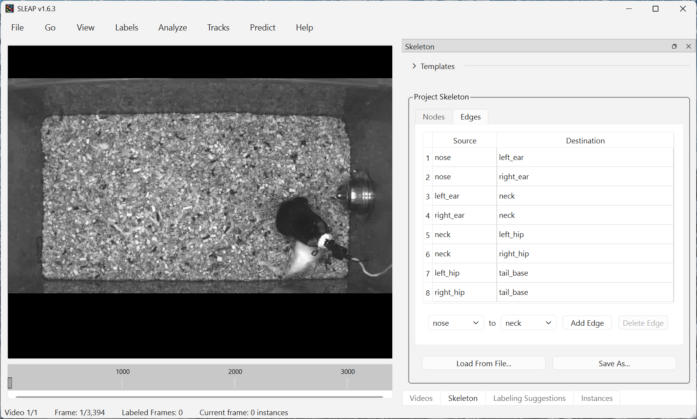{width=100%}

Once you have defined the skeleton, save the project by clicking on "File" → "Save" (or with <kbd>Ctrl</kbd>/<kbd>Cmd</kbd>+<kbd>S</kbd>).

### Sample frames

For assembling a set of frames for annotation, you can either pick your own frames, or let SLEAP suggest a set of frames using the "Labeling Suggestions" panel, which offers several [automated sampling strategies](https://docs.sleap.ai/latest/learnings/gui/#labeling-suggestions) to help select informative and diverse frames.

In this example, we will use the "Labeling Suggestions" panel to randomly sample 20 frames from the video.

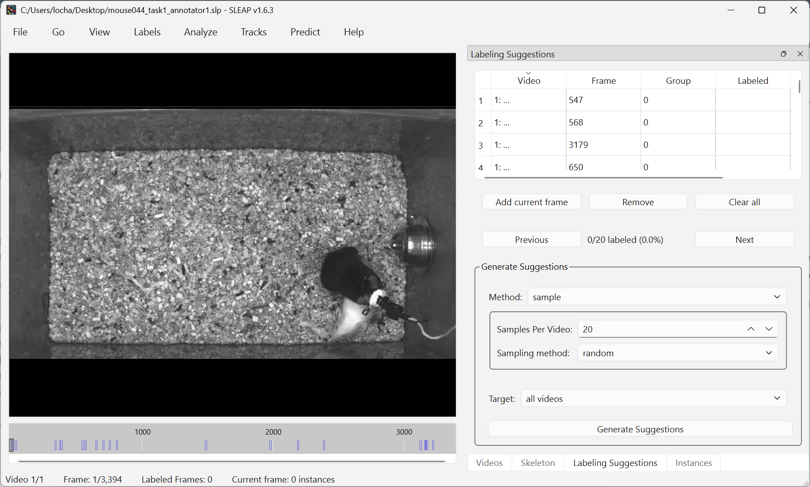{width=100%}

### Label frames

To begin labelling, click on "Labels" → "Add Instance" in the top menu bar.
The initial instance will have its nodes placed randomly.
Adjust each point to its correct location by dragging it with the mouse.

In this example, the black mouse's nose is occluded by an implant.
To mark the node as hidden, right-click the node or its name to toggle visibility.
If you can reasonably infer its location, you can also mark it as "visible" to help the model learn to predict occluded nodes.

For tracking the identities of the animals, we will also assign identities to each instance by adding a `Track`.
This step is optional if you are only tracking a single animal or if the animals are visually indistinguishable.

To assign a track, select an instance and click on "Tracks" → "Set Instance Track" in the top menu bar.
A new `Track` ("Track 1") will be created.
`Tracks` can be renamed in the "Track" column.
In this example, we will name the black mouse `resident_b` and the white mouse `intruder_w`.

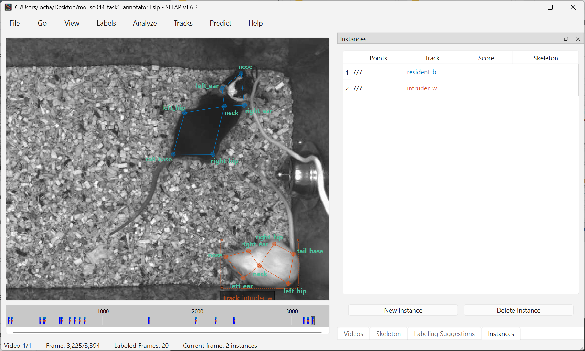{width=100%}

Once you have labelled the initial frame, you can navigate to the previous or next suggested frame by clicking "Previous" or "Next" in the "Labeling Suggestions" panel.

To speed up labelling in subsequent frames, right-click on the frame and choose from several options for adding a new instance. For example, selecting "Copy prior frame" will duplicate the instance(s) from the previous labelled frame, allowing you to quickly adjust only the necessary points. This is especially useful when animal poses change gradually between frames.

::: {.callout-important}
Remember to save your progress frequently by clicking "File" → "Save" (or with <kbd>Ctrl</kbd>/<kbd>Cmd</kbd>+<kbd>S</kbd>).
:::

You may also find the following keyboard shortcuts and mouse actions helpful (go to "Help" → "Keyboard Shortcuts" for the full list and optionally customise them):

| Function | Keyboard shortcut/Mouse actions |
|----------|---------------------------------|
| Add instance | <kbd>Ctrl</kbd>/<kbd>Cmd</kbd>+<kbd>I</kbd> |
| Add new track | <kbd>Ctrl</kbd>/<kbd>Cmd</kbd>+<kbd>0</kbd> |
| Assign track | Select instance, then <kbd>Ctrl</kbd>/<kbd>Cmd</kbd>+<kbd>1-9</kbd> (number = track ID) |
| Toggle node visibility (occlusion) | Right-click on node or its label |
| Move entire instance | Hold <kbd>Alt</kbd> (Windows) / <kbd>Option</kbd> (Mac) and drag any node |
| Rotate instance | Hold <kbd>Alt</kbd> (Windows) / <kbd>Option</kbd> (Mac), click on any node, and scroll mouse wheel |
| Zoom in/out | Place cursor over area to zoom in or out, then scroll mouse wheel |
| Delete instance | Select instance, then <kbd>Ctrl</kbd>/<kbd>Cmd</kbd>+<kbd>Backspace</kbd> |
| Navigate between frames | <kbd>Left</kbd>/<kbd>Right</kbd> |
| Go to the next suggested frame | <kbd>Space</kbd> |
| Go to the previous suggested frame | <kbd>Shift</kbd> + <kbd>Space</kbd> |
| Go to the next labelled frame | <kbd>Alt</kbd> (Windows) / <kbd>Option</kbd> (Mac) + <kbd>right</kbd> |
| Go to the previous labelled frame | <kbd>Alt</kbd> (Windows) / <kbd>Option</kbd> (Mac) + <kbd>left</kbd> |

See also [SLEAP's GUI guide on "Labels"](https://docs.sleap.ai/latest/learnings/gui/#labels) for a complete reference of all labelling functions.

::: {.callout-tip title="Discuss"}
- How did you find the labelling process? What challenges did you encounter?
- What strategies could annotators use to ensure consistency throughout the labelling process?
- How might the quality of annotations affect model performance?
:::

### Configure and train models

Once you have labelled a sufficient number of frames, you can configure and train your first model.
To do this, go to "Predict" → "Run training" in the top menu bar.

Here, we will employ the [appearance-based tracking approach](#identity-tracking-approaches) for maintaining consistent identities of individual animals across frames.
To do so, select **"multi-animal top-down-id"** as the "Pipeline Type".
We will also configure the training pipeline to predict on 20 more frames randomly sampled from the video (skipping user-labelled frames) once training is complete.

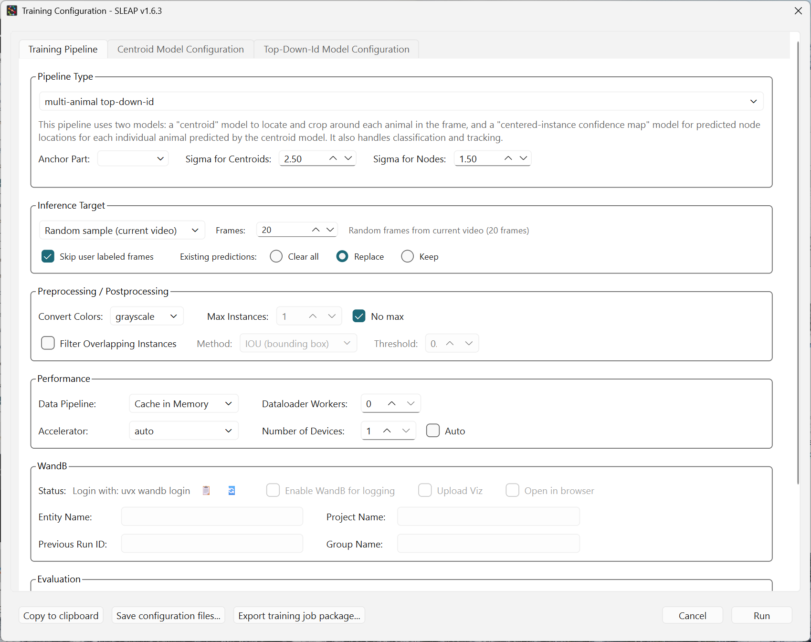{width=100%}

See also [SLEAP's Configuring models guide](https://nn.sleap.ai/latest/reference/models/) for further details on model types and training options.

#### Centroid model

We will now configure the **Centroid model**, which predicts the location of each animal in each frame.

Since we have labelled only a small number of frames, increase the validation fraction (e.g. 0.2) in "Data" to obtain more stable and representative validation metrics.
To reduce the risk of overfitting, in "Optimization", set the number of training epochs to a low value (e.g. 10–20 epochs).

Next, adjust the receptive field size to match the scale of the features you want the model to detect.
This can be achieved by adjusting "Input Scaling" in "Data" and "Max Stride" in "Model".

To help the model generalise to animals in different orientations, in "Augmentation", enable random rotation augmentation by setting "Rotation" (e.g. ±180°).

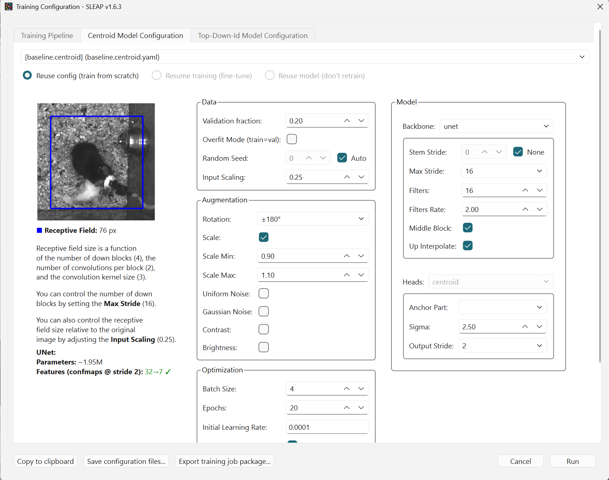{width=100%}

::: {.callout-tip}
As a rule of thumb, the receptive field (blue box in the preview) should be large enough to cover the whole animal. Since the centroid model only needs to locate animals coarsely, you can downsample the input more aggressively (e.g. to 0.25×) than for the top-down ID model, which needs to resolve fine details. This saves computation, especially in early labelling rounds with limited training data.
:::

#### Top-down ID model

The **Top-down ID model** predicts the full pose (locations of all defined nodes) and assigns identities to each animal in each frame.

As with the Centroid model, configure the validation split, number of training epochs, random rotation augmentation, and receptive field size accordingly.

You may also want to reduce the batch size (e.g. to 4) to ensure the model trains reliably and fits within memory constraints, especially when using limited hardware resources (e.g. CPU or lower-end GPUs).

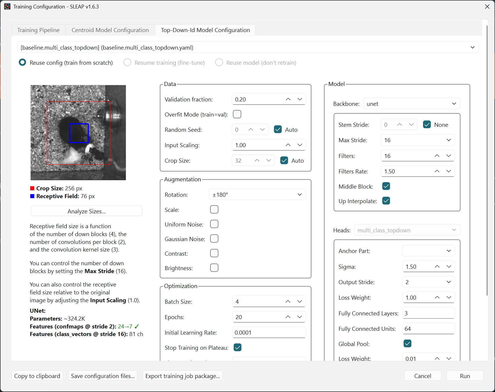{width=100%}

Once you have configured the models, click "Run" to begin training.

### Monitor training progress

You should now see a training progress window showing the loss curves and metrics for each model as it trains.

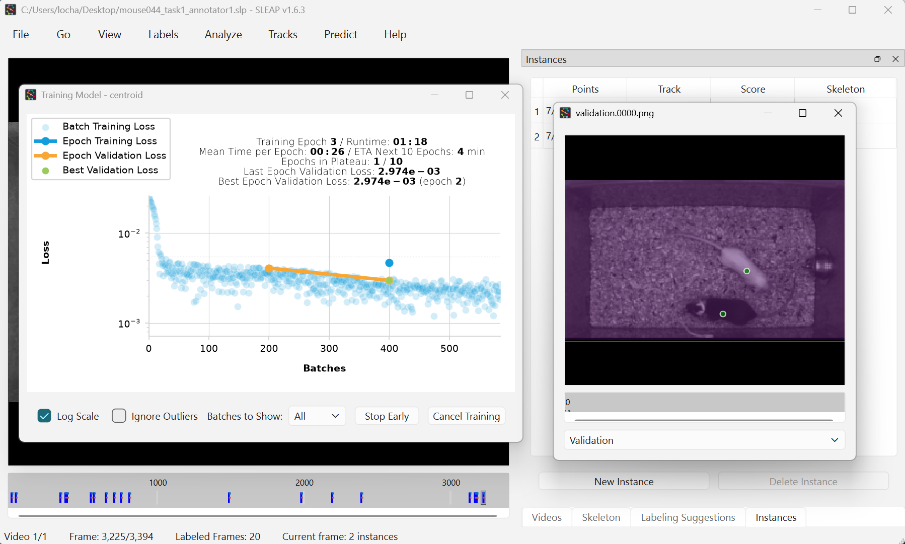{width=100%}

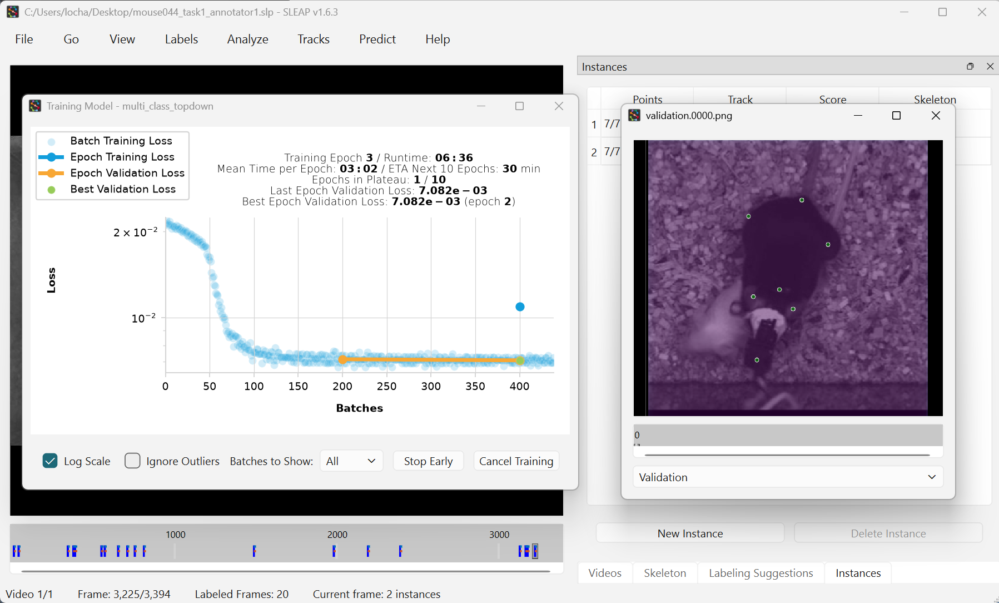{width=100%}

::: {.callout-tip}
SLEAP supports remote training and inference workflows, allowing users to leverage external computational resources, particularly those with GPU support, for batch training or inference.
For detailed instructions and guidance, see the [Running SLEAP remotely guide](https://docs.sleap.ai/latest/guides/running-sleap-remotely/).
:::

### Run inference and proofread predictions

After the models are trained, if you had configured the training pipeline to run inference upon completion, SLEAP will automatically apply the trained models to the selected frames.

Alternatively, to manually run inference on random frames with your trained models, go to the "Predict" and select "Run Inference" in the top menu bar.

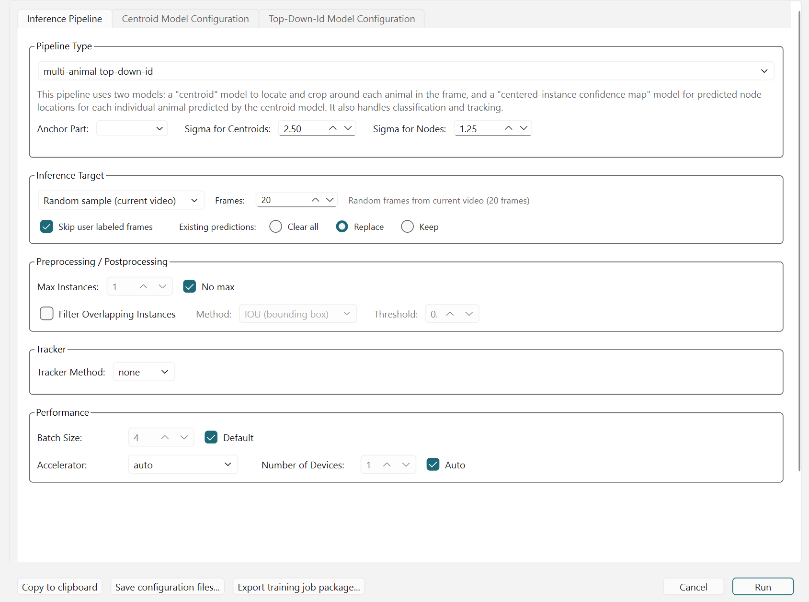{width=100%}

::: {.callout-note}
Since we have trained an [appearance-based ID model](#identity-tracking-approaches), which outputs identity assignments directly for each detected animal in each frame, there is no need to configure a "Tracker" (typically used for temporal-based tracking).
Further details on the Tracker module is available in [SLEAP's Tracking and proofreading guide](http://legacy.sleap.ai/guides/proofreading.html).
:::

Labelled frames (frames with user or predicted labels) will be marked in the seekbar.

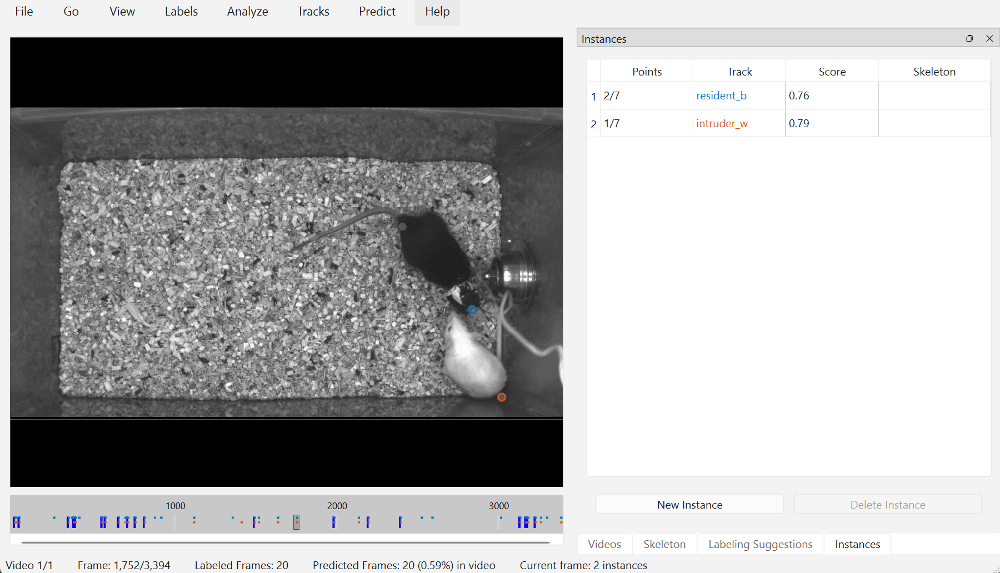{width=100%}

To step through labelled frames, click on "Go" and "Next Labeled Frame" (or use <kbd>Alt</kbd> (Windows) / <kbd>Option</kbd> (Mac) + <kbd>left</kbd>/<kbd>right</kbd>).

The models are not expected to perform well at this stage, but you can review and correct these predictions, and merge them back into your training dataset.
You can also generate more labelling suggestions and label them to ensure your training dataset captures a wider range of poses and variations.
Once you have added and/or corrected more instances, you can repeat the process: train a new model, predict on more frames, correct those predictions, and so on until you are ready to apply the model on the entire video.

See [SLEAP's Prediction-assisted labeling guide](http://legacy.sleap.ai/tutorials/assisted-labeling.html) for more details on this iterative process.

::: {.callout-note}
Predicted instances will not be used for model training unless you correct the predictions in the GUI.
:::

### Evaluate trained models

The metrics of trained models can be accessed by clicking on "Predict" → "Evaluation Metrics for Trained Models" in the top menu bar.

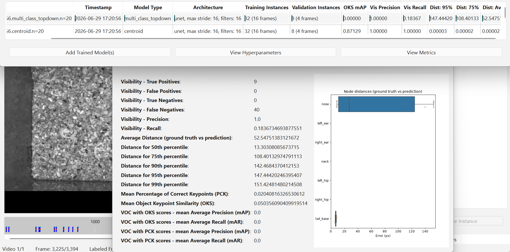{width=100%}

See [SLEAP's Model evaluation guide](http://legacy.sleap.ai/notebooks/Model_evaluation.html) for examples on generating accuracy metrics for your trained model.
