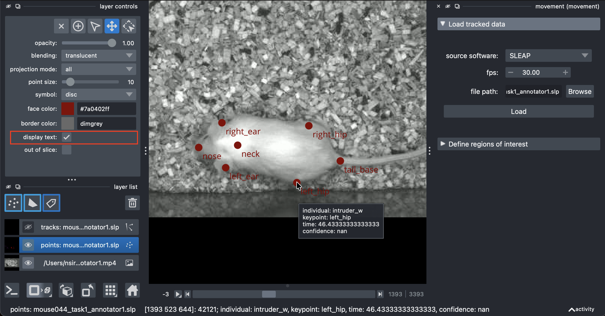
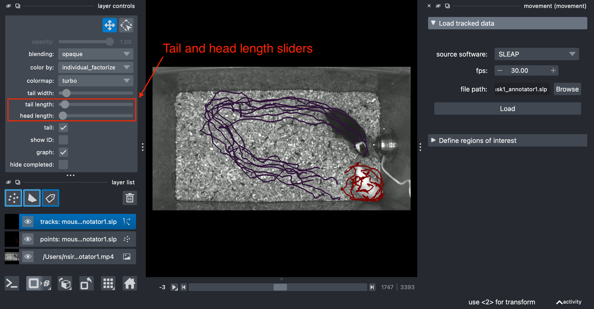

# Analysing tracks with movement {#sec-movement-intro}

In this tutorial, we will introduce the main features of [movement](https://movement.neuroinformatics.dev/),
a Python package for analysing animal motion tracks.
You will be given a set of exercises to complete—using `movement` to analyse the pose tracks you've generated in @sec-sleap or any other tracking data you may have access to.

::: {.callout-note title="Using the right environment"}

If you are following along this chapter on your own computer,
make sure to run all code snippets with the `animals-in-motion-env` environment activated
(see [prerequisites @sec-install-movement]). This also applies to launching the
`movement` graphical user interface (@sec-movement-gui).

:::

```{python}
#| include: false
import xarray as xr

xr.set_options(
    display_expand_attrs=False,
    display_expand_coords=False,
    keep_attrs=True,
)
```

## What is movement?

In [Chapters @sec-intro] and [-@sec-dl-cv] we saw how the rise of deep learning-based markerless motion tracking tools is transforming the study of animal behaviour.

In [@sec-sleap] we dove deeper into [SLEAP](https://sleap.ai/), a popular package for pose estimation and tracking.
We saw how SLEAP and similar tools—like
[DeepLabCut](https://www.mackenziemathislab.org/deeplabcut) and [LightningPose](https://lightning-pose.readthedocs.io/en/latest/)—detect the positions of user-defined keypoints in video frames,
group the keypoints into poses, and connect their identities across time into sequential collections we call pose tracks.

The extraction of pose tracks is often just the beginning of the analysis.
Researchers use these tracks to investigate various aspects of animal behaviour, such as kinematics, spatial navigation, social interactions, etc (the *motion quantification* step from @fig-ethology-workflow).
Typically, these analyses involve custom, project-specific scripts that are hard to reuse across different projects and are rarely maintained after the project's conclusion.

In response to these challenges, we saw the need for a versatile and easy-to-use toolbox that is compatible with a range of ML-based motion tracking frameworks and supports interactive data exploration and analysis.
That's where `movement` comes in—it answers the question **what can I do with these tracks?**

::: {.callout-note title="movement's mission"}

`movement` aims to facilitate the study of animal behaviour
by providing a consistent, modular interface for analysing motion tracks,
enabling steps such as data cleaning, visualisation, and motion quantification.

See [movement's mission and scope statement](https://movement.neuroinformatics.dev/latest/community/mission-scope.html) for more details.

:::

{#fig-movement-overview}

You can interface with `movement` in two ways:

1. Use the [graphical user interface (GUI)](https://movement.neuroinformatics.dev/latest/user_guide/gui.html) to interactively explore motion tracks overlaid on video frames, and to define regions of interest (ROIs) for further analysis
2. Use the [programmatic interface (Python API)](https://movement.neuroinformatics.dev/latest/api_index.html) to call `movement` functions from your own scripts and Jupyter notebooks, accessing its full capabilities for cleaning, plotting and analysing motion tracks.

This tutorial will introduce both approaches.

## Visualise data in the GUI {#sec-movement-gui}

The `movement` [graphical user interface (GUI)](https://movement.neuroinformatics.dev/latest/user_guide/gui.html),
powered by our custom plugin for [napari](https://napari.org/dev/),
makes it easy to view and explore motion tracks.
You can use it to visualise 2D (`x,y`) motion tracking data as points, tracks,
and rectangular bounding boxes (if defined) overlaid on video frames.

Let's use it to look at the predictions we generated in @sec-sleap!

::: {.callout-note}
The workflow described here closely follows the [`movement` GUI guide](https://movement.neuroinformatics.dev/latest/user_guide/gui.html), adapted to our dataset. Refer to the `movement` docs for additional details.
:::

### Launch the GUI

First, launch the GUI from the command line:

```bash
movement launch
```

You will see a window like the one below.

{width=100%}

### Load a video

Though not strictly necessary, it is informative to view the motion tracks overlaid on a background that provides some spatial context. You can either load the video corresponding to the dataset, or load a single image (e.g., a still frame derived from that video).

Here we will load `mouse044_task1_annotator1.mp4` from the CalMS21 dataset, i.e., the video we used in @sec-sleap to generate pose tracks.

Drag and drop the video file directly onto the `napari` viewer, or by using the "File" > "Open File(s)" menu option.
You will be prompted via a pop-up dialog to select the reader. Choose "video" and click "OK".
You can optionally select to remember this reader for all files with the same extension.

The video will be loaded as an [image layer](https://napari.org/stable/howtos/layers/image.html) with a slider at the bottom that you can use to navigate through frames.
You may also use the left and right arrow keys to navigate frame-by-frame.

{width=100%}

Clicking on the play button will start the video playback at a default rate of 10 frames per second.
You can adjust the playback speed by right-clicking on the play button.

### Load motion tracks

Now you are ready to load some motion tracks over the video.

On the right-hand side of the window you should see an expanded "Load tracked data" menu.
You can load data from one of the [supported third-party formats](https://movement.neuroinformatics.dev/latest/user_guide/input_output.html#target-supported-formats) or from a [netCDF file](https://movement.neuroinformatics.dev/latest/user_guide/input_output.html#target-netcdf) saved with `movement`.

To load tracked data in napari:

1. From the "source software" dropdown menu select the name of the tracking software you used to generate the data (in this case `SLEAP`).
2. Set the "fps" (frames per second) of the video the data corresponds to (in this case `30`).
3. Click the "Browse" button to select a file containing the tracked data—i.e. one of the predictions .slp files you generated in @sec-sleap, or the `mouse044_task1_annotator1.slp` file that came with the CalMS21 dataset ([prerequisites @sec-data]).
4. Click "Load".

The data will be loaded into the viewer as a [points layer](https://napari.org/stable/howtos/layers/points.html) and as a [tracks layer](https://napari.org/stable/howtos/layers/tracks.html).
By default, the data is added at the top of the layer list and the points layer is selected.

You will see a view similar to this:

{width=100%}

::: {.callout-note title="Layer types"}
In `napari`, data is represented as [layers](https://napari.org/stable/getting_started/layers.html#layers-glance), which can be reordered and toggled for visibility in the layers list panel.
There are many types of layers, each corresponding to a different data type, visualisation, and interactivity.

The important layer types for `movement` are:

1. [Image layers](https://napari.org/stable/howtos/layers/image.html) for displaying images and stacks of images (including videos).
2. [Points layers](https://napari.org/stable/howtos/layers/points.html) for displaying collections of points.
3. [Tracks layers](https://napari.org/stable/howtos/layers/tracks.html) for displaying collections of trajectories over time.
4. [Shapes layers](https://napari.org/stable/howtos/layers/shapes.html) for displaying geometric shapes, such as rectangles, circles, and polygons.

:::

### Explore motion tracks

Let's focus on the points layer first (make sure it's selected), which shows the keypoints detected on the current frame.
You may turn off the visibility of the tracks layer for now, to reduce visual clutter.

Video frames and keypoints are synchronised, so you can see how the keypoints move across frames as you navigate through the video.

Enabling the "display text" option in the layer controls panel will show the keypoint names next to each point.

Hovering with your mouse over a point will bring up a tooltip containing the properties of that point:
individual identity, keypoint name, time (in seconds), and the confidence score.

{width=100%}

Now select the tracks layer and turn its visibility back on.

The tracks layer allows us to visualise the positions of a keypoint before (the **tail**) and after the current frame (the **head**).
This view is especially useful for identifying tracking errors, such as identity swaps, which are often hard to spot when looking at a single frame.

The tail and head lengths can be adjusted independently in the tracks layer controls panel, using the "tail length" and "head length" sliders, respectively.

{width=100%}

::: {.callout-tip title="Discuss"}

- Did you spot any errors in the data you've explored?
- What kinds of errors do you expect in pose tracks?
- How can such errors be avoided or corrected?
:::

### Additional GUI features

Apart from what we covered above, the `movement` GUI also allows you to:

- [visualise tracked bounding boxes](https://movement.neuroinformatics.dev/latest/user_guide/gui.html#the-boxes-layer) (for the formats that support them), and
- define regions of interest (ROIs) and export them for further analysis (we will cover this in  @sec-movement-mouse).

We are also actively working on adding more features to the GUI, including the ability to manually fix tracking errors.

::: {.callout-tip title="Discuss"}
What features would **you** like to see in the `movement` GUI?

Visit the [movement community page](https://movement.neuroinformatics.dev/latest/community) to find about ways to let us know and get involved.
:::

## Analyse data in Python {#sec-movement-python}

For the rest of this chapter, we encourage you to follow along in a Jupyter notebook or in your favourite Python IDE (see @sec-install-devtools), using the `animals-in-motion-env` environment as your Python kernel (see @sec-install-movement).

### Load motion tracks

`movement` supports many popular animal tracking frameworks and file formats,
in 2D and 3D, tracking single or multiple animals of any species.

This allows for analysis pipelines that are input-agnostic, meaning they are not tied to a specific motion tracking tool or data format.
To achieve this, `movement` includes input/output functions that facilitate data flows between various [third-party formats](https://movement.neuroinformatics.dev/latest/user_guide/input_output.html#target-supported-formats) and `movement`'s own native data structure based on `xarray`
(more on that structure later in this chapter).

{#fig-movement-io}

Let's see these capabilities in action, by loading the same SLEAP predictions file we explored in the GUI, but this time in Python.

First, let's define the path to the file we want to load.
Here we choose to express the path relative to our home directory, but you can also use an absolute path.

```{python}
from pathlib import Path

file_name = "mouse044_task1_annotator1.slp.250811_154148.predictions.slp"
predictions_dir = Path.home() / ".movement" / "CalMS21" / "better_model" / "predictions"
file_path = predictions_dir / file_name
```

To load the data, we pass the above path to `movement`'s [`load_dataset()` function](https://movement.neuroinformatics.dev/latest/api/movement.io.load.load_dataset.html).

```{python}
from movement.io import load_dataset

ds = load_dataset(file_path, fps=30)
```

::: {.callout-note}
When we loaded this file in the GUI, this same `load_dataset` function was called behind the scenes to parse the data into a standardised format that `movement` can work with.

Note that we didn't have to specify the source software (`SLEAP`) this time;
`movement` can automatically infer that from the file's extension and contents, and in most cases it will do the right thing.
That said, you can also be explicit if you want to:

```{.python}
ds = load_dataset(file_path, source_software="SLEAP", fps=30)
```

:::

### The anatomy of a movement dataset

Let's look into the dataset we just loaded.

```{python}
ds
```

We see an interactive description of a so-called `xarray.Dataset`.
*What is that?*
It's okay if you've never worked with such data before, we will build some understanding as we go along.

The dataset description refers to **dimensions**, **coordinates**, **data variables**, and **attributes**.
Expand the following boxes to read about each element.

::: {.callout-note title="Dimensions" appearance="minimal" collapse="true"}
These are the axes along which the data can vary.

```{python}
#| echo: false
for dim in ds.dims:
    print(f"{dim}: size {ds.sizes[dim]}")
```

:::

::: {.callout-note title="Coordinates" appearance="minimal" collapse="true"}
These are the labels that identify the values along each dimension.
Think of them as "tick marks" along each axis.

```{python}
#| echo: false
import numpy as np

with np.printoptions(precision=3, suppress=True):
    for coord, da in ds.coords.items():
        print(f"{coord}: {da.values}")
```

:::

::: {.callout-note title="Data variables" appearance="minimal" collapse="true"}
These are the actual data arrays (matrices) that hold the measurements we are interested in. We have two of them in this dataset: `position` and `confidence`.

```{python}
ds.position
```

`position` is a 4-dimensional array with all the same dimensions as the dataset itself. Its values are the `(x,y)` spatial coordinates of each keypoint, for each individual, at each time point.

```{python}
ds.confidence
```

`confidence` is a 3-dimensional array, with the same dimensions minus `space`. Its values are the confidence scores associated with each keypoint, for each individual, at each time point.
:::

::: {.callout-note title="Attributes" appearance="minimal" collapse="true"}

These are metadata that describe the dataset as a whole.

```{python}
ds.attrs
```

Specific attributes can be accessed directly:

```{python}
print(ds.source_software)
print(ds.fps)
```

:::

Putting it all together, a **dataset** (`xarray.Dataset`) is a collection of **data variables** that share some **dimensions** and **coordinates**, and may come with some metadata as **attributes**. Each **data variable** is a multi-dimensional array (`xarray.DataArray`) that holds the actual measurements.

{#fig-movement-ds-poses}

What we just described is a so-called `movement` **poses dataset**, for representing pose tracking data.
`movement` also supports **bounding boxes datasets**, consisting of boxes that enclose animals, tracked over time.

The dataset structure is similar for both types, with a few differences. See [the documentation on movement datasets](https://movement.neuroinformatics.dev/latest/user_guide/movement_dataset.html).

::: {.callout-tip title="Discuss"}

- How would we represent 3D pose tracks in a `movement` dataset? What would change?
- What of tracking data with only one individual, or one keypoint?
- Can you think of a pose tracking scenario that would not fit into this dataset structure?
:::

::: {.callout-note title="xarray, numpy, and pandas" collapse="true"}
If you've worked with data in Python before, you may be familiar with [numpy](https://numpy.org/) and [pandas](https://pandas.pydata.org/).

`xarray` builds on top of both, and is a kind of hybrid between them.

- Like `numpy`, `xarray` provides multi-dimensional arrays and a rich set of built-in numerical operations.
- Like `pandas`, `xarray` data are labelled, which makes manipulations more readable.

If you are used to working with `numpy` and `pandas`, `xarray`'s syntax will feel familiar.
You can also convert `xarray` objects to the other two formats, if needed.

Export `position` as a `numpy` array:

```{python}
position_array = ds.position.to_numpy()
print(position_array.shape)
```

Export `position` as a `pandas` DataFrame:

```{python}
position_df = ds.position.to_dataframe(
    dim_order=["time", "individual", "keypoint", "space"]
)
position_df.head()
```

:::

### Working with movement datasets

Since `movement` represents motion tracking data as `xarray` objects, we can use all of `xarray`'s rich
[built-in functionalities](https://movement.neuroinformatics.dev/latest/user_guide/movement_dataset.html#using-xarrays-built-in-functionality)
for data handling.

We can select a subset of data along any dimension in a variety of ways,
by integer index (order) or coordinate label.

```{python}
# First individual, first time point
ds.isel(individual=0, time=0)

# 0-10 seconds, two specific keypoints
ds.sel(time=slice(0, 10), keypoint=["left_ear", "right_ear"])
```

We can also 'chain' selection operations.
For example, we can first access the position data variable, and then select a subset of it:

```{python}
ds.position.sel(individual="resident_b")
```

We can do all sorts of [computations](https://docs.xarray.dev/en/stable/user-guide/computation.html)
on the data, along any dimension.

For example, it's often useful to compute the **centroid** (centre-of-mass) trajectories of the tracked individuals. If we were to do this 'by hand', we would have to average the `x` and `y` coordinates of all keypoints for each individual, at each time point. With `xarray`, we can do this in one line of code, with `xarray` handling the dimensionality for us.

```{python}
centroid_position = ds.position.mean(dim="keypoint")
centroid_position
```

What would happen if we instead took the mean across time?

```{python}
ds.position.mean(dim="time")
```

::: {.callout-note}
Note that the dimension being averaged disappears from the output.
In other words: the average position across time no longer varies with time.
:::

We can take a similar approach with many common statistical operators, including minimum (`min`), maximum (`max`) and median `median`.

```{python}
# The minimum x positions across time, for every individual and keypoint
min_x = ds.position.sel(space="x").min(dim="time")
min_x
```

`xarray` also provides a rich set of built-in [plotting methods](https://docs.xarray.dev/en/stable/user-guide/plotting.html) for quickly visualising the data. Let's use them to create some line plots.

```{python}
#| label: fig-plot-tail-base-pos
#| fig-cap: "The x,y spatial coordinates of the tail_base keypoint across time."

tail_base_pos = ds.sel(keypoint="tail_base").position
tail_base_pos.plot.line(
    x="time", hue="individual", row="space",  aspect=2, size=2.5
)
```

::: {.callout-note title="Understanding the plot.line command" collapse="true"}
The data variable named before `.plot.line`—in this case `tail_base_pos`—corresponds to the y-axis of the figure.

You can understand the rest of the command as mapping dataset dimensions to various features of the figure.

- `time` is mapped onto the x-axis.
- Each `individual` is plotted with a different colour (hue).
- `space` coordinates `x` and `y` appear on different subplots (rows).
- We don't have to map the `keypoint` dimension, because we've only selected one keypoint.

Experiment with the `plot.line` command by swapping these mappings around.

The `aspect` and `size` arguments control the size and shape of the resulting figure
via the formula `figsize = (aspect * size, size)`.
:::

::: {.exercise-prompt}
Keep working with the loaded dataset `ds` and try the following:

1. Select the position of the `neck` keypoint for the first 60 seconds of the recording.
2. Compute the median position of the `neck` across the selected time window, for each individual. Which individual is closer to the left side (`x` closer to zero) of the arena?
3. Show the centroid position of both individuals as a line plot across time. Plot the `x` and `y` positions on different subplots and give a different colour to each individual.

**Bonus**

4. Select 3 keypoints of `resident_b`, and show their confidence values across time as a line plot. Plot each keypoint on a different subplot.
5. Visualise the overall distribution of confidence scores in the dataset, using the `plot.hist` method. Does anything surprise you about the distribution?
:::

::: {.exercise-solution}

The `neck` position for the first 60 seconds:

```{python}
neck_pos = ds.position.sel(keypoint="neck", time=slice(0, 60))
```

We first compute the median across time for the above variable.
Then we show the `x` coordinates of that median.

```{python}
neck_pos_median = neck_pos.median(dim="time")
neck_pos_median.sel(space="x")
```

We can see that `resident_b` is closer to the left side of the arena (smaller `x` value).

The centroid position of each individual is plotted across time.

```{python}
centroid_pos = ds.position.mean(dim="keypoint")
centroid_pos.plot.line(
    x="time", hue="individual", row="space",  aspect=2, size=2.5
)
```

**Bonus**

We select 3 keypoints on the head of `resident_b` and plot their confidence scores across time.

```{python}
head_conf = ds.confidence.sel(
    individual="resident_b",
    keypoint=["nose", "left_ear", "right_ear"]
)
head_conf.plot.line(
    x="time", row="keypoint", aspect=2, size=2.5
)
```

The overall distribution of confidence scores as a histogram.

```{python}
ds.confidence.plot.hist(bins=50, aspect=2, size=2.5);
```

Surprisingly, a few confidence scores have values >1.0. That's because SLEAP's point-wise confidence scores—unlike the likelihood scores output by DeepLabCut—are not confined to the [0,1] range.
:::

### Clean motion tracks

Referring back to @fig-plot-tail-base-pos, we can see that the position trajectories exhibit some problems that are common to pose tracking data:

- There are brief gaps of missing values. These are likely due to occlusions, when a body part is not visible in the video frame.
- There are a few sudden jumps in the trajectories, which look implausible. These can occur when the pose estimation model misidentifies a keypoint, or when the tracking algorithm swaps the identities of two individuals.

`movement` offers several methods for dealing with errors in motion tracking, as part of its
[`movement.filtering`](https://movement.neuroinformatics.dev/latest/api/movement.filtering.html) module.
These include functions for:

- identifying and removing outliers
- interpolating missing data
- smoothing trajectories over time
  
Let's import two such functions from `movement.filtering` and see them in action.

```{python}
from movement.filtering import filter_by_confidence, rolling_filter
```

First, let's use [`filter_by_confidence`](https://movement.neuroinformatics.dev/latest/api/movement.filtering.filter_by_confidence.html)
to drop all positions with confidence scores below a chosen threshold.
Dropping here means replacing them with `NaN` (not-a-number) values, which are recognised as missing data by most scientific computing libraries.

```{python}
position_filtered = filter_by_confidence(
    ds.position, ds.confidence, threshold=0.7, print_report=True
)
```

The choice of threshold is arbitrary, and should be guided by the confidence score distribution in the dataset, and by inspection of the resulting filtered tracks.

Setting `print_report=True` prints a report on the number of missing values before and after filtering, so we can see how much data we 'lost' in the process.

Let's generate the same plot as @fig-plot-tail-base-pos, but this time with the filtered data.

```{python}
#| label: fig-plot-tail-base-pos-filtered
#| fig-cap: "The tail_base trajectories after filtering by confidence score."

position_filtered.sel(keypoint="tail_base").plot.line(
    x="time", hue="individual", row="space",  aspect=2, size=2.5
)
```

We managed to remove most implausible jumps in the trajectories, but we also introduced more gaps in the data.
This is a typical trade-off when filtering data, and settling on the right threshold requires some experimentation.

Even after dropping low-confidence positions, the remaining tracks may still exhibit
frame-to-frame jitter—small, noisy fluctuations that do not reflect the animal's
true motion but arise because pose estimation models process each frame independently.
A rolling median filter can suppress this noise by replacing each value with the
median of the surrounding frames within a sliding window.

Let's apply [`rolling_filter`](https://movement.neuroinformatics.dev/latest/api/movement.filtering.rolling_filter.html)
to the confidence-filtered positions, using a window of 5 frames:

```{python}
position_smooth = rolling_filter(
    position_filtered, window=5, statistic="median"
)
```

```{python}
#| label: fig-plot-tail-base-pos-smooth
#| fig-cap: "The tail_base trajectories after applying a rolling median filter (window=5)."

position_smooth.sel(keypoint="tail_base").plot.line(
    x="time", hue="individual", row="space", aspect=2, size=2.5
)
```

The trajectories are noticeably smoother, but some of the gaps seem to have grown.

::: {.exercise-prompt}
Now experiment with the median filter yourself.

1. Try applying `rolling_filter` to `position_filtered` with `window` values of 3 and
   11 (keeping `statistic="median"`). For each, plot the `tail_base` keypoint
   trajectory. How do the results differ?

__Bonus__

1. By default (`min_periods=None`). Using `window=11`, set `min_periods=1`
   and plot the result. How does the output differ? What is the trade-off? *(Tip: set
   `print_report=True` to observe the effect on the number of missing values.)*
:::

::: {.exercise-solution}

We apply the filter with three different window sizes and plot the `tail_base` trajectory
each time.

```{python}
#| fig-cap: "Rolling median filter with window=3."

rolling_filter(
    position_filtered, window=3, statistic="median"
).sel(keypoint="tail_base").plot.line(
    x="time", hue="individual", row="space", aspect=2, size=2.5
)
```

```{python}
#| fig-cap: "Rolling median filter with window=11."

rolling_filter(
    position_filtered, window=11, statistic="median"
).sel(keypoint="tail_base").plot.line(
    x="time", hue="individual", row="space", aspect=2, size=2.5
)
```

With `window=3` the result is very close to the unsmoothed data—only the sharpest
single-frame spikes are removed. With `window=11` the trajectory is much smoother,
but also contains much longer gaps.

Now we compare the default `min_periods=None` against `min_periods=1` with `window=11`.

__Bonus__

```{python}
#| fig-cap: "Rolling median filter with window=11 and min_periods=None (default)."

rolling_filter(
    position_filtered, window=11, statistic="median"
).sel(keypoint="tail_base").plot.line(
    x="time", hue="individual", row="space", aspect=2, size=2.5
)
```

```{python}
#| fig-cap: "Rolling median filter with window=11 and min_periods=1."

rolling_filter(
    position_filtered, window=11, statistic="median", min_periods=1
).sel(keypoint="tail_base").plot.line(
    x="time", hue="individual", row="space", aspect=2, size=2.5
)
```

By default, whenever one or more NaNs are present in the window, a NaN is returned to the output array.
As a result, any stretch of NaNs present in the input data will be propagated proportionally to the size of the window (specifically, by `floor(window/2)`).
To control this behaviour, the `min_periods` option can be used to specify the minimum number of valid (non-NaN) values required in the window to compute a result.
For example, setting `min_periods=1` will result in the filter returning NaNs only when all values in the window are NaN, since 1 valid value is sufficient to compute the result.

:::

For what follows, we will use the smoothed position data with `window=7` and `min_periods=2`, which we will store as `position_smooth`.

```{python}
position_smooth = rolling_filter(
    position_filtered, window=7, statistic="median", min_periods=2,
)
```

Let's compute the centroid trajectories of the smoothed data (`centroid_smooth`) and plot them across time.

```{python}
#| label: fig-plot-centroid-pos-smooth
#| fig-cap: "The centroid trajectories after filtering by confidence score and applying a rolling median filter."
centroid_smooth = position_smooth.mean(dim="keypoint")
centroid_smooth.plot.line(
    x="time", hue="individual", row="space", aspect=2, size=2.5
)
```

::: {.callout-tip}
You can learn more about `movement.filtering` by going through the following notebooks in `movement`'s
[example gallery](https://movement.neuroinformatics.dev/latest/examples/index.html):

- [Drop outliers and interpolate](https://movement.neuroinformatics.dev/latest/examples/filter_and_interpolate.html)
- [Smooth pose tracks](https://movement.neuroinformatics.dev/latest/examples/smooth.html)
:::

### Save movement datasets

If we want to closely inspect what our data cleaning accomplished, it would help to overlay the smoothed motion tracks on the original video in the GUI, like we did in @sec-movement-gui.

To do that, we need to first create a new `movement` dataset containing the cleaned data, and then save it to disk in a format that the GUI can read.

We can accomplish the first step by updating the `position` data variable in the original dataset:

```{python}
ds_cleaned = ds.copy()
ds_cleaned.update({"position": position_smooth})
ds_cleaned
```

This dataset is in every way identical to the original one, except that the `position` data variable now contains the filtered and smoothed data.

For saving datasets to disk, we recommend leveraging `xarray`'s built-in
[support for the netCDF file format](https://docs.xarray.dev/en/stable/user-guide/io.html#netcdf).

```{.python}
import xarray as xr

save_path = predictions_dir / "ds_smooth.nc"
ds_cleaned.to_netcdf(save_path)
```

The same dataset can be loaded back into Python with `xr.open_dataset(save_path)`, or into the GUI by selecting "movement (netCDF)" as the source software when loading tracked data.

::: {.callout-tip title="Discuss"}
Repeat the workflow outlined in @sec-movement-gui, but this time load the cleaned dataset `ds_smooth.nc` instead of the original SLEAP predictions file.

Keep in mind that the tracks layer display linearly interpolates between consecutive points, so the gaps in the original data will be filled in with straight lines. You're better off turning off the tracks layer visibility and focusing on the points layer, which shows the actual positions of the keypoints.

Are you happy with what you see? If not, what would you do differently?
:::

::: {.callout-note title="Exporting to other file formats"}
Saving to netCDF is the recommended way to preserve the complete state of your `movement` analysis, including all variables, coordinates, and attributes.
That said, in some cases it's useful to export data back to the original DeepLabCut or SLEAP formats, or to neuroscientific standards like [NWB files](https://pynwb.readthedocs.io/en/stable/).

`movement` provides some functions for exporting datasets to third-party formats, which you can find in the [input/output section of the documentation](https://movement.neuroinformatics.dev/latest/user_guide/input_output.html#saving-pose-tracks).
:::

### How far apart are the two mice?

The resident-intruder assay is, at its core, about a social interaction between two
animals. A natural first question is therefore: **how far apart are the two mice at
each moment in time?**

We can look into the [`movement.kinematics`](https://movement.neuroinformatics.dev/latest/api/movement.kinematics.html) module,
which provides functions for deriving various useful quantities
from motion tracks, such as velocity, acceleration, distances, orientations, and angles.

{#fig-movement-kinematics}

The most suitable function to help us answer the above question is [`compute_pairwise_distances`](https://movement.neuroinformatics.dev/latest/api/movement.kinematics.compute_pairwise_distances.html),
which computes distances between pairs of individuals (or, if we prefer, between pairs of keypoints).

As a starting point for all quantifications, we will use the smoothed centroid
trajectories we computed at the end of the cleaning step
(see @fig-plot-centroid-pos-smooth).

```{python}
from movement.kinematics import compute_pairwise_distances

distance = compute_pairwise_distances(
    centroid_smooth, dim="individual", pairs={"resident_b": "intruder_w"}
)
distance
```

We asked for distances along the `individual` dimension, and specified a single pair
of individuals. The `individual` dimension therefore disappears from the output, leaving
us with a 1-dimensional array holding one distance value—in pixels—per time point.

Let's plot it.

```{python}
#| label: fig-plot-inter-mouse-distance
#| fig-cap: "Distance between the centroids of the two mice across time."

distance.plot.line(x="time", aspect=3, size=2.5)
```

The two mice repeatedly come together and move apart again, so this single variable
already gives us a compact, high-level summary of the encounter.

::: {.callout-tip title="Discuss"}
The distance is measured in pixels. What would you need to know to express it in centimetres instead?
:::

::: {.exercise-prompt}
Knowing *where* the mice are relative to each other tells us when they meet, but not
*what* they do when they get there. Perhaps we can get a sense of their activity levels
during close encounters by looking at their instantaneous speed over time.

1. Use [`compute_speed`](https://movement.neuroinformatics.dev/latest/api/movement.kinematics.compute_speed.html)
   to compute the speed of each mouse's centroid across time.
2. Plot the speed of both mice on separate rows. Which mouse appears more active overall?

__Bonus__

3. Now plot the intruder's speed and the inter-mouse distance on top of each other, sharing a
   common time axis. What relationships—if any—can you spot between the two?
   *(Tip: Use `matplotlib` to create the figure.)*
4. What proportion of time do the two mice spend with their centroids within 130 pixels
   (roughly equal to 1 mouse body length in this video) of each other?
   *(Tip: Look up and use the [`xarray.where` method](https://docs.xarray.dev/en/stable/user-guide/indexing.html#masking-with-where).)*
:::

::: {.exercise-solution}

We compute the speed of each centroid. The output keeps the `individual` dimension,
giving us one speed trace per mouse.

```{python}
from movement.kinematics import compute_speed

speed = compute_speed(centroid_smooth)
speed
```

We plot the speed of both mice on separate rows.

```{python}
speed.plot.line(x="time", row="individual", aspect=2, size=2.5)
```

The intruders appears more active overall, with higher-amplitude speed bursts.
But beware: the speed spike near the 40-second mark looks like an artifact that has lingered despite out cleaning;
3000 pixels per second doesn't look plausible.

__Bonus__

We select the intruder's speed and place it alongside the inter-mouse distance in two
stacked subplots that share a common time axis.

```{python}
#| label: fig-plot-intruder-speed-and-distance
#| fig-cap: "Intruder speed (top) and inter-mouse distance (bottom) across time."

import matplotlib.pyplot as plt

intruder_speed = speed.sel(individual="intruder_w")

fig, axes = plt.subplots(2, 1, sharex=True, figsize=(7, 5))

intruder_speed.plot.line(x="time", ax=axes[0])
axes[0].set_ylabel("speed (pixels/s)")
axes[0].set_xlabel("")

distance.plot.line(x="time", ax=axes[1], color="black")
axes[1].set_ylabel("distance (pixels)")

fig.tight_layout()
```

To find what proportion of frames the two mice spend within 130 pixels of each other,
we use `xarray.where` to retain only the frames meeting that condition and compare
the count of remaining values to the total.

```{python}
close = distance.where(distance < 130)
proportion = close.count() / distance.count()
print(f"{proportion.item():.1%} of frames have centroids within 130 pixels of each other.")
```

:::

::: {.callout-tip}
You can learn more about `movement.kinematics` by going through the following notebooks in `movement`'s
[example gallery](https://movement.neuroinformatics.dev/latest/examples/index.html):

- [Compute and visualise kinematics](https://movement.neuroinformatics.dev/latest/examples/compute_kinematics.html)
- [Compute head direction](https://movement.neuroinformatics.dev/latest/examples/compute_head_direction.html)
- [Pupil tracking](https://movement.neuroinformatics.dev/latest/examples/mouse_eye_movements.html)


We will also cover some more advanced kinematic analyses in the next two chapters—[@sec-movement-mouse] and [@sec-movement-zebras]—where we will apply `movement` to some real-world datasets.
:::

## Join the movement {#sec-movement-next}

This chapter does not represent a full list of `movement`'s current and future capabilities.
The package will continue to evolve as it's being actively developed by a core team of engineers
(aka the authors of this book) supported by a growing, global
[community of contributors](https://movement.neuroinformatics.dev/latest/community/people.html).

We are committed to openness and transparency and always welcome feedback and contributions from the community,
especially from practising animal behaviour researchers, to shape the project's direction.

Visit the [movement community page](https://movement.neuroinformatics.dev/latest/community)
to find about ways to get help and get involved.

::: {.callout-tip}
If you have ideas for improving `movement`, you can suggest them for the collaboration days!
:::
