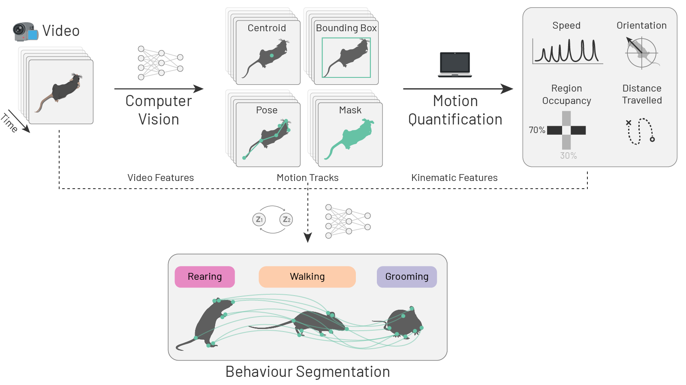
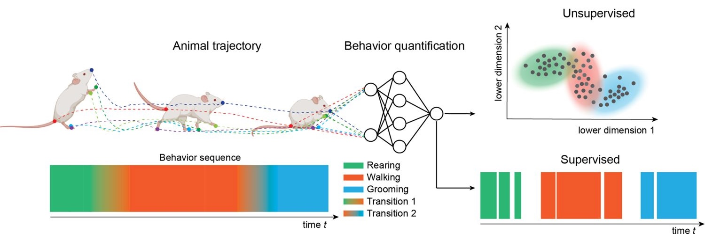

<!-- markdownlint-disable MD045 -->

# Behaviour annotation with BORIS {#sec-boris}

Before we proceed, make sure you have installed [BORIS](https://www.boris.unito.it/) (see [prerequisites @sec-install-boris]).
You will also need the files `mouse044_task1_annotator1.mp4` and `mouse044_task1_mount_events_boris.tsv` downloaded from [Dropbox](https://www.dropbox.com/scl/fo/81ug5hoy9msc7v7bteqa0/AH32RLdbZqWZJstIeR4YHZY?rlkey=blgagtaizw8aac5areja6h7q1&st=xni448zl&dl=0) (see [prerequisites @sec-data]).

## Supervised behaviour classification

Pose estimation tools such as SLEAP (see @sec-sleap) reveal *where* animals are, while motion quantification tools like `movement` (see @sec-movement-intro) show us *how* they move. Neither category tells us *what* behaviour is occurring at any given moment.

Supervised behaviour classification addresses this gap: a **behaviour classifier** learns to assign discrete behavioural states—e.g. grooming, investigation, chasing—to each frame or time point. In practice, this is often framed as **behaviour segmentation**, since the classifier must segment a continuous stream of video or motion data into labelled behavioural states.

Behaviour segmentation typically operates on one or more of the following **features** as inputs:

- video segments
- the associated motion-tracking data
- kinematic variables derived from motion-tracking data.

{width=100%}

**Supervised behaviour classifiers** learn to map these features to discrete behavioural states based on labelled examples provided by a human expert. Such **labels** indicate which behavioural states occur at each time point or frame. Their quality and quantity directly determine what the classifier can learn, making careful, consistent annotation a foundational requirement for any supervised behaviour analysis workflow.

::: {.callout-note title="Approaches to behaviour segmentation" collapse="true"}
There are various ways to segment continuous motion into discrete behavioural states, including:

- **Human annotation**: a human observer watches videos and annotates frames with behaviours of interest. You will get a taste of this in this chapter.
- **Rule-based**: a fixed set of rules to describe the criteria that must be met to determine a behaviour's occurrence, e.g. a speed threshold above which an animal is considered to be "locomoting". We will touch on this in @sec-classification.
- **Supervised classification**, already explained above. We will go through this in detail in @sec-classification.
- **Unsupervised methods**: the model discovers behavioural states from the data, without any user-defined examples. These methods often employ dimensionality reduction followed by clustering, as in [MotionMapper](https://github.com/gordonberman/MotionMapper) [@berman_mapping_2014] and [B-SOID](https://github.com/YttriLab/B-SOID) [@hsu_b-soid_2021]. Some tools also rely on state-space models, such as hidden Markov models (HMMs) and auto-regressive HMMs; see [VAME](https://ethoml.github.io/VAME/) [@luxem_identifying_2022] and [Keypoint MoSeq](https://dattalab.github.io/moseq2-website/index.html) [@weinreb_keypoint-moseq_2024].
- Hybrid approaches:
  - self-supervised. Example tools include [LISBET](https://github.com/BelloneLab/lisbet) [@chindemi2023lisbet].
  - semi-supervised.

{#fig-behav-segmentation width=100%}

Table 1 in @goodwin_simple_2024 offers a nice overview of open-source tools for behaviour segmentation, grouped by approach.
See Figure 3 in @pereira_quantifying_2020 for segmentation schematics.

Challenges:

- Behaviour is hierarchical and operates at multiple timescales, e.g. a walking bout alternates between swinging and stance phases.
- Many behaviours can co-occur simultaneously, e.g. walking and sniffing,
- Human annotators often disagree on what constitutes a behaviour, and how to label it.
- Supervised methods often inherit the biases of human annotators.
- Behavioural states output by unsupervised methods are often difficult to interpret.
:::

## How can we annotate behaviours?

There are various tools to help with behaviour annotation (refer to @sec-useful-tools and @luxem_open-source_2023).
Here, we introduce [BORIS](https://www.boris.unito.it/) [@friard_boris_2016], a widely adopted, free, open-source, tool designed for this task.
BORIS offers a keyboard-shortcut-based interface for annotating behaviours in video recordings, structured around a project that defines an **ethogram**—a catalogue of all behaviours to be annotated.
Annotations can be exported in multiple formats for downstream analysis.

While, in principle, one could use BORIS to manually annotate every frame of every video in a dataset, this is often impractical for large datasets.
A common approach is therefore to annotate a subset of videos, train a supervised classifier on those annotations, and then use that classifier to automatically label the remaining videos—effectively teaching the computer to reproduce the annotation "style" of a human expert.

Structurally, this mirrors the supervised workflow used for pose estimation in @sec-workflow-sleap: select data, annotate, train, and predict—only with behaviour labels instead of keypoints.
Unlike SLEAP, which integrates this entire workflow into a single application, BORIS supports only the annotation step.
Classifier training and inference are handled separately, covered in @sec-classification.

## Dataset and task

The [CalMS21 dataset](https://sites.google.com/view/computational-behavior/our-datasets/calms21-dataset) [@sun_caltech_2021], as introduced in @sec-sleap, captures interactions between two mice in a **resident–intruder assay** [@jove4367]: a black resident mouse and a white intruder mouse.

For simplicity, this tutorial focuses on annotating a single, easily identifiable behaviour—the resident mounting the intruder—on the same video used in @sec-sleap: `mouse044_task1_annotator1.mp4`. These annotations can then be used to train a **binary classifier**, where each frame is labelled as either "mounting" or "not mounting".

::: {.callout-note}
The original "Task 1" defined by @sun_caltech_2021 is a **multi-class classification problem** aiming to identify four behavioural states—`attack`, `investigation`, `mount` and `other`. Although we annotate only `mount` here, the same workflow can be extended by adding more behaviours to the ethogram.
:::

## BORIS workflow

::: {.callout-note}
The workflow described here follows the [official user guide](https://www.boris.unito.it/user_guide/) for BORIS v9.x, adapted to our dataset and task. The interface may differ slightly in other versions. Our example is intentionally simple—refer to the official documentation for richer examples, advanced options, and more complex annotation workflows.
:::

```{mermaid}
graph LR
   project("Project<br>(ethogram + subjects)") --> obs
    video("Video") --> obs[/Observation/]
    obs --> |"annotate<br>behaviours"| events[/Event<br>annotations/]
    events --> |export| tsv[/TSV file/]
```

Our annotation workflow consists of the following key steps:

1. **Create a project**: start a new BORIS project and configure its basic settings.
2. **Define the ethogram**: add the behaviours to be annotated and assign keyboard shortcuts.
3. **Add subjects**: specify the individual animals whose behaviour will be annotated.
4. **Start an observation**: create an observation for the video file.
5. **Annotate events**: step through the video and use keyboard shortcuts to mark behaviour onsets and offsets.
6. **Export the data**: save the annotations as a tab-separated values (TSV) file for downstream analysis.

### Create a new project

[Open BORIS](https://www.boris.unito.it/user_guide/start/) and create a new project via "Project" → "New project".
This brings up the project dialog, which contains multiple tabs that we will work through to configure the project.

On the "Project" tab:

- Set a "Project name", e.g. `calms21_resident_intruder`.
- Optionally add a "Project description".
- Set "Time format" to "Seconds".

{width=100%}

### Define the ethogram

Navigate to the "Ethogram" tab.
The ethogram lists all behaviours to be annotated.

We will add a single behaviour: `mount`.

1. Click "Behaviour" → "Add new behaviour".
2. Under "Behaviour type", select "State event"—a state event has a start and an end, whereas a point event is instantaneous.
3. Set "Code" to `mount`.
4. (Optional) Assign a "Key", e.g. `m`. A keyboard shortcut lets you code events quickly.
5. (Optional) Add a description. For example, you may include the following excerpt from @sun_caltech_2021:

> **Mount**: behavior in which the resident is hunched over the intruder, typically from the  rear, and grasping the sides of the intruder using forelimbs. Early-stage copulation is accompanied by rapid pelvic thrusting, while later-stage copulation (sometimes annotated separately as intromission) has a slower rate of pelvic thrusting with some pausing: for the purpose of this analysis, both behaviors should be counted as mounting, however periods where the resident is climbing on the intruder but not attempting to grasp the intruder or initiate thrusting should not.

{width=100%}

::: {.callout-tip title="Exclusion matrix"}
For a single behaviour there is no need to configure an "Exclusion matrix" (which specifies behaviours that cannot co-occur).
If you later extend the ethogram—for example by adding `attack` or `investigation`—you can return to the "Ethogram" tab and define which pairs are mutually exclusive. When you set up this matrix, starting a new coded behaviour automatically stops any ongoing conflicting behaviour. This helps you code more quickly and keeps your annotations consistent

For a more complex worked example that uses the "Exclusion matrix" extensively, see [`movement`'s Annotate and load events with BORIS example](https://movement.neuroinformatics.dev/dev/examples/advanced/annotate_boris_events.html).
:::

### Add subjects

Navigate to the "Subjects" tab.

BORIS allows coding behaviours for different subjects within a single observation.
By defining "Subjects", you can specify which individual is performing each behaviour.
Because `mount` is defined in the ethogram as a behaviour performed by the resident mouse, we only need to add a single subject to represent the resident mouse.
If you wish to annotate the intruder mounting the resident mouse, you can add a second subject representing the intruder (and update the behaviour description in the ethogram accordingly).

Click "Subject" → "Add a new subject" and add a subject named `resident_b`. Optionally assign the "Key" `b` as a keyboard shortcut and add a description.

{width=100%}

Click "OK" to close the project dialog.
Save the project via "Project" → "Save project" (or <kbd>Ctrl</kbd>/<kbd>Cmd</kbd>+<kbd>S</kbd>), choosing a location and filename such as `calms21_resident_intruder.boris`.

::: {.callout-important}
BORIS does not auto-save by default. Get into the habit of saving frequently throughout the annotation session with <kbd>Ctrl</kbd>/<kbd>Cmd</kbd>+<kbd>S</kbd>.
:::

### Start an observation

Create a new observation via "Observations" → "New observation".

- Set an "Observation ID", e.g. `mouse044_task1`.
- Select "Observation from media file(s)".
- Click "Add media" → "with absolute path" and navigate to `mouse044_task1_annotator1.mp4`.
- Click "Start".

{width=100%}

The video will open in the main BORIS window alongside the ethogram and subjects panels.

{width=100%}

::: {.callout-note title="For macOS users"}
On macOS, the video will appear in a separate floating window alongside the main BORIS GUI. You can resize and reposition the video window as needed.

Remember to click on the main BORIS window during annotation, otherwise key presses will not be recorded.
:::

### Annotate events

You are now ready to annotate the video.
The following steps describe the basic annotation cycle:

1. **Select the focal subject** by double-clicking `resident_b` in the Subjects panel. If you assigned a key (e.g. <kbd>b</kbd>), you can also press it to select the subject.
2. **Step through the video** frame by frame using the <kbd>←</kbd> and <kbd>→</kbd> arrow keys, or use the step buttons and slider in the video playback controls at the top of the observation window.
   You can also press the <kbd>Space</kbd> bar to play or pause the video.
   For brief or fast-moving events, reducing playback speed (e.g. to 0.5×) can make them easier to identify.
3. **Annotate the start of a mount event** by pressing <kbd>m</kbd> at the frame where mounting begins.
   The annotated event appears in the event log at the bottom-right of the window with its "Time" recorded and its "Type" marked as "START".
4. **Annotate the end of the mount event** by pressing <kbd>m</kbd> again at the frame where mounting ends.
   Another event entry is added to the event log with its "Time" recorded and its "Type" marked as "STOP", completing the mount event.
5. Repeat steps 3–4 for each mounting bout throughout the video.

::: {.callout-warning title="Arrow keys on macOS"}
The <kbd>←</kbd>/<kbd>→</kbd> arrow keys may not work for frame stepping on macOS—BORIS can misidentify them as numpad keys, which are unassigned by default.
If this happens, use the step buttons in the video playback controls instead.
:::

{width=100%}

After a first pass through the video, you may want to review your annotations and make adjustments.
You can double-click a row in the event log to jump to an event's frame, and right-click the row to reveal some helpful options, such as:

- "Edit selected event(s)"
- "Shift time of selected event(s)"
- "Delete selected event(s)"
- "Check state events" (to ensure that all state events have both a start and a stop time)
- "Fix unpaired events" (to automatically close any open state events at the end of the video).

::: {.callout-note title="Frame indexes"}
If you notice any event lacking a "Frame index" in the event log, you can populate the corresponding column by running "Observations" → "Add frame indexes". Typically, this is only necessary if you are implicitly closing one behaviour by starting another mutually exclusive behaviour. This should not be an issue in our single-behaviour example.
:::

You may also visualise your annotations in BORIS. Try the "Plot current observation" and "Plot current time budget" buttons in the top toolbar.

### Export the data

Export your annotations via "Observations" → "Export events" → "Aggregated events".
In the dialog:

- Select your observation (`mouse044_task1`) and click "OK".
- Select the observed subject (`resident_b`) and behaviour (`mount`) to export, then click "OK".
- Choose a destination and filename, e.g. `mouse044_task1_mount.tsv`. Leave the format as "Tab Separated Values (*.tsv)".

The exported file contains one row per annotated event, with relevant columns including "Subject", "Behavior", "Start (s)", "Stop (s)", "Duration (s)", "Image index start", and "Image index stop".

::: {.callout-tip title="Discuss"}

Open the TSV file you exported in Excel, Google Sheets, LibreOffice Calc, Numbers, or any text editor. Compare it with the ground-truth annotations provided as `mouse044_task1_mount_events_boris.tsv`, which are also shown here for your convenience (only relevant columns are displayed):

```{python}
#| echo: false

from pathlib import Path
import pandas as pd

file_name = "mouse044_task1_mount_events_boris.tsv"
file_path = Path.home() / ".movement" / "CalMS21" / file_name

df = pd.read_csv(file_path, sep="\t")
show_columns = [
   "Subject", "Behavior", "Start (s)", "Stop (s)", "Duration (s)",
   "Image index start", "Image index stop"
]
df[show_columns]
```

- How did your annotations differ from the ground truth?
- Did you miss any bouts or find extra ones?
- Did you annotate the start and stop times differently?

:::
