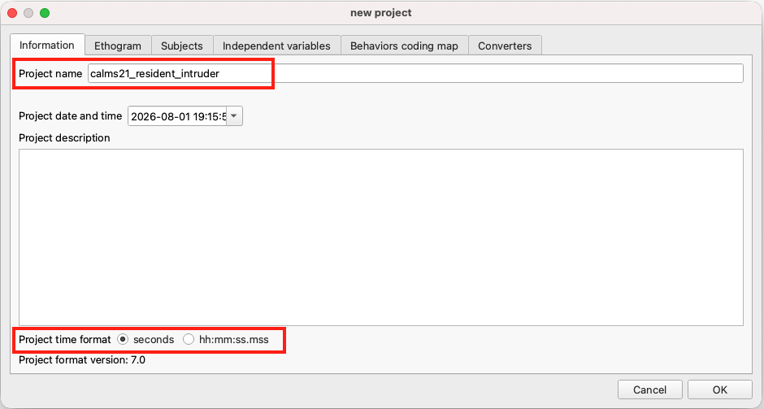
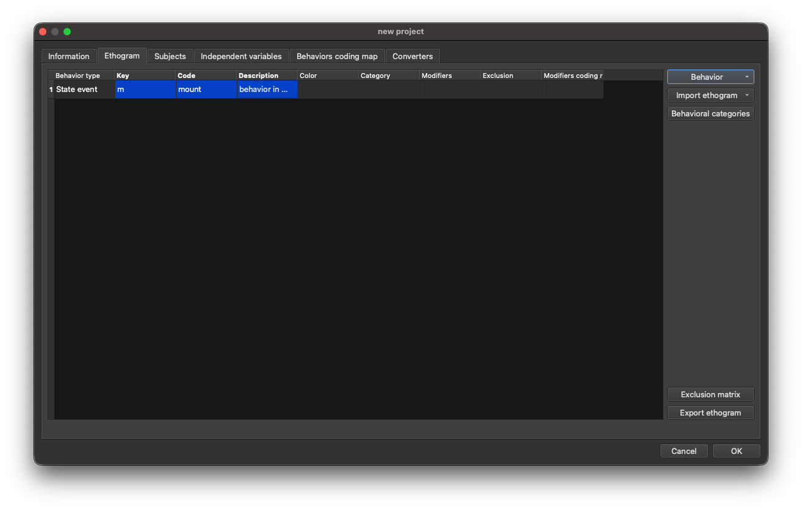
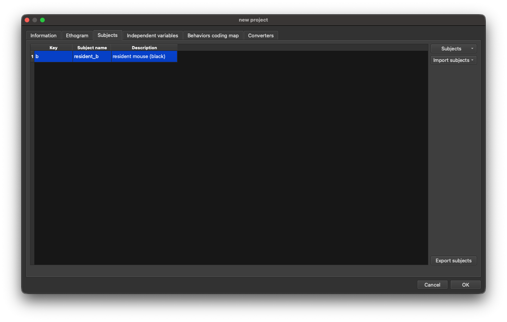
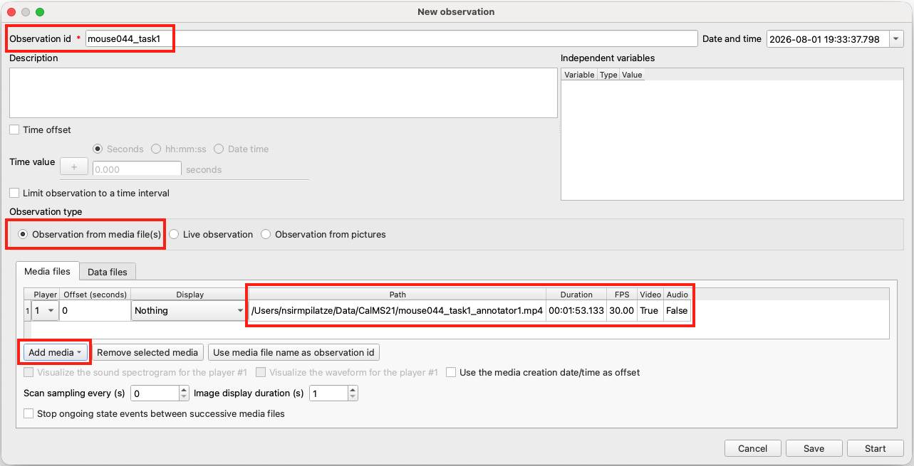
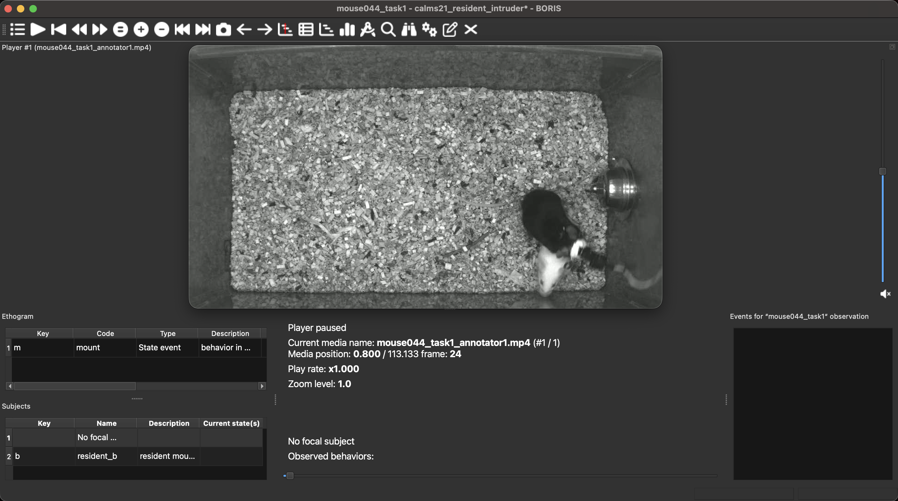
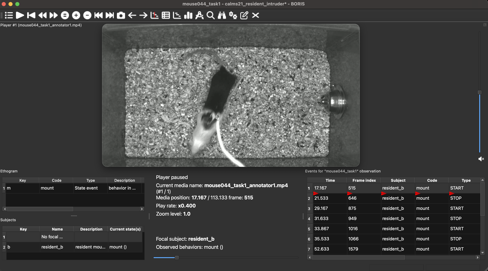

<!-- markdownlint-disable MD045 -->

# Behaviour annotation with BORIS {#sec-boris}

Before we proceed, make sure you have installed [BORIS](https://www.boris.unito.it/) (see [prerequisites @sec-install-boris]).
You will also need the video file `mouse044_task1_annotator1.mp4` downloaded from [Dropbox](https://www.dropbox.com/scl/fo/81ug5hoy9msc7v7bteqa0/AH32RLdbZqWZJstIeR4YHZY?rlkey=blgagtaizw8aac5areja6h7q1&st=xni448zl&dl=0) (see [prerequisites @sec-data]). If you have gone through @sec-sleap, you should already have this video.

## Supervised behaviour classification

Pose estimation tools such as SLEAP (see @sec-sleap) reveal *where* animals are and *how* they move, but they do not by themselves tell us *what* behaviour is occurring at any given moment.
Identifying discrete behaviours—e.g. distinguishing a mounting bout from an investigation or a chase—requires a behaviour classifier.

**Supervised behaviour classifiers** learn to recognise behaviours from labelled examples: they are trained on segments of video (or the associated pose-tracking data) that a human expert has tagged with the behaviour present in them.
The quality and quantity of those manual annotations directly determines what the classifier can learn, making careful, consistent annotation a foundational step in any supervised behaviour analysis pipeline.

[BORIS](https://www.boris.unito.it/) [@friard_boris_2016] is a free, open-source, cross-platform tool designed for exactly this task.
It provides a keyboard-shortcut-driven interface for annotating behaviours in video recordings, organised around a structured project that contains an **ethogram**—a catalogue of all behaviours to be annotated—and one or more **subjects** (the individual animals whose behaviour is to be recorded).
Annotations can be exported in several formats for downstream analysis.

## Dataset

In this tutorial we will annotate a single behaviour, **mount**, in the same video used in the SLEAP tutorial (see @sec-sleap): `mouse044_task1_annotator1.mp4` from the [CalMS21 dataset](https://sites.google.com/view/computational-behavior/our-datasets/calms21-dataset) [@sun_caltech_2021].

As introduced in @sec-sleap, this video captures an interaction between two mice in a **resident-intruder assay** [@jove4367]: a black resident mouse and a white intruder mouse.

One of the key social behaviours visible in this assay is mounting, in which the resident climbs onto the back of the intruder.
@sun_caltech_2021 defines mounting as follows:

> **Mount**: behavior in which the resident is hunched over the intruder, typically from the  rear, and grasping the sides of the intruder using forelimbs ... Early-stage copulation is accompanied by rapid pelvic thrusting, while later-stage copulation (sometimes annotated separately as intromission) has a slower rate of pelvic thrusting with some pausing: for the purpose of this analysis, both behaviors should be counted as mounting, however periods where the resident is climbing on the intruder but not attempting to grasp the intruder or initiate thrusting should not...

In BORIS' own terminology, mounting is a **state event**—it has a clear onset and offset and spans multiple frames.

## BORIS workflow

```{mermaid}
graph LR
    video("Video") --> obs[/Observation/]
    project("Project<br>(ethogram + subjects)") --> obs
    obs --> |"annotate<br>behaviours"| events[/Event<br>annotations/]
    events --> |export| tsv[/TSV file/]
```

::: {.callout-note}
The steps described here were written for BORIS v9.x.
The interface may differ slightly in other versions.
Refer to the [BORIS user guide](https://www.boris.unito.it/user_guide/) for version-specific details.
:::

A BORIS annotation workflow consists of the following key steps:

1. **Create a project**: open a new BORIS project and configure its basic settings.
2. **Define the ethogram**: add the behaviours to be annotated, each with a type and a keyboard shortcut.
3. **Add subjects**: define the individual animals whose behaviour will be recorded.
4. **Start an observation**: create an observation linked to the video file.
5. **Annotate events**: step through the video and use keyboard shortcuts to record behaviour onsets and offsets.
6. **Export the data**: save the annotations as a TSV file for downstream analysis.

### Create a new project

Open BORIS and create a new project via **Project > New project**.
A project dialogue will open with several tabs.

On the **Project** tab:

- Set a **Project name**, e.g. `calms21_resident_intruder`.
- Optionally add a **Project description**.
- Set **Time format** to `Seconds`.

<!-- {width=100%} -->

### Define the ethogram

Navigate to the **Ethogram** tab.
An ethogram lists all behaviours to be annotated, each assigned a unique keyboard shortcut for rapid coding.

We will add a single behaviour: `mount`.

1. Click **Behaviour > Add new behaviour** (or the **+** button in the Ethogram panel).
2. Under **Behaviour type**, select **State event**—a state event has a start and an end, as opposed to a point event, which is instantaneous.
3. Set the **Behaviour code** to `mount`.
4. Assign the **Key** `m`.

<!-- {width=100%} -->

::: {.callout-tip}
For a single behaviour there is no need to configure an **Exclusion matrix** (which defines mutually exclusive behaviours that cannot co-occur).
If you later extend the ethogram—adding `chase` or `investigate`, for example—you can return to the Ethogram tab and define which pairs are mutually exclusive, so that starting one behaviour automatically closes any conflicting open event.
:::

### Add subjects

Navigate to the **Subjects** tab.
Subjects allow you to attribute each annotation to a specific individual rather than recording behaviour without an actor.

Click **Subject > Add subject** (or the **+** button in the Subjects panel) and add one subject:

| Subject name | Key |
|---|---|
| `resident_b` | `b` |

<!-- {width=100%} -->

Click **OK** to close the project dialogue.
Save the project via **Project > Save project** (or <kbd>Ctrl</kbd>/<kbd>Cmd</kbd>+<kbd>S</kbd>), choosing a location and filename such as `calms21_resident_intruder.boris`.

::: {.callout-important}
BORIS does not auto-save. Get into the habit of saving frequently throughout the annotation session with <kbd>Ctrl</kbd>/<kbd>Cmd</kbd>+<kbd>S</kbd>.
:::

### Start an observation

Create a new observation via **Observations > New observation**.

- Set an **Observation ID**, e.g. `mouse044_task1`.
- Tick **Observation from media file(s)**.
- Click **Add media > with absolute path** and navigate to `mouse044_task1_annotator1.mp4`.
- Click **Start**.

<!-- {width=100%} -->

The video will open in the main BORIS window alongside the ethogram and subjects panels.

<!-- {width=100%} -->

### Annotate events

You are now ready to annotate.
The following steps describe the basic annotation cycle:

1. **Select the focal subject** by clicking `resident_b` in the Subjects panel, or by pressing its assigned key <kbd>b</kbd>.
   The selected subject is highlighted to confirm your choice.
2. **Navigate the video** using the <kbd>←</kbd> and <kbd>→</kbd> arrow keys to step frame by frame, or use the playback controls at the top of the video panel.
   Reducing playback speed (e.g. to 0.5×) can help when events are brief or fast-moving.
3. **Open a mount event** by pressing <kbd>m</kbd> at the frame where mounting begins.
   The event appears in the event log at the bottom of the screen with its start time recorded.
4. **Close the mount event** by pressing <kbd>m</kbd> again at the frame where mounting ends.
   The event is now recorded with both a start and a stop time.
5. Repeat steps 3-4 for each mounting bout throughout the video.

<!-- {width=100%} -->

::: {.callout-tip}
Before exporting, run **Observations > Add frame indexes** to populate the frame-index columns in the output file.
Frame indices are required when loading annotations into tools such as `movement` that work with frame-indexed data.
:::

::: {.callout-tip title="Discuss"}
- How did you find the annotation process? What ambiguous cases did you encounter (e.g. partial or interrupted mounts)?
- How would you define clear onset and offset criteria for mounting, so that multiple annotators produce consistent labels?
- How might annotation inconsistencies affect a downstream supervised classifier trained on these labels?
:::

### Export the data

Export your annotations via **Observations > Export events > Aggregated events**.
In the dialogue:

- Select your observation (`mouse044_task1`).
- Choose **TSV** as the file format.
- Choose a destination and filename.

<!-- {width=100%} -->

The exported file contains one row per annotated event, with columns including the subject, behaviour code, start and stop times (in seconds), and start and stop frame indices.

::: {.callout-note}
For a worked example of how to load a BORIS-exported TSV into a `movement` dataset and attach the annotations as per-frame behaviour labels, see the [`movement` documentation: Annotate and load events with BORIS](https://movement.neuroinformatics.dev/examples/advanced/annotate_boris_events.html).
:::
