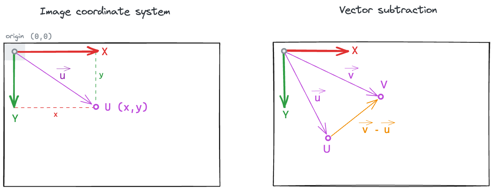
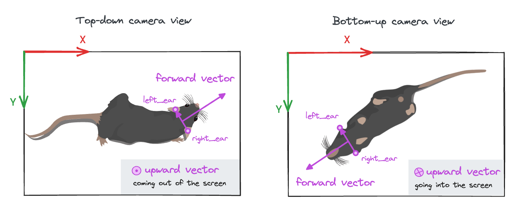

<!-- markdownlint-disable MD045 -->

# Training a supervised behaviour classifier {#sec-classification}

In @sec-boris we used BORIS to annotate `mount` events on the video
`mouse044_task1_annotator1.mp4`. In this chapter we put those annotations to work:
we train a **supervised behaviour classifier** that learns to detect `mount` frames
automatically from features derived from the pose tracks.

We will use [movement](https://movement.neuroinformatics.dev/latest/index.html) to compute the features,
and [scikit-learn](https://scikit-learn.org/stable/index.html) to train a simple [random forest classifier](https://en.wikipedia.org/wiki/Random_forest).
Both packages are included in the `animals-in-motion-env` environment (see
[@sec-install-movement]), so make sure you have that environment activated before proceeding.

We will also use:

* the manually annotated SLEAP file (`mouse044_task1_annotator1.slp`) containing pose tracks, and
* the BORIS ground-truth behaviour annotations (`mouse044_task1_mount_events_boris.tsv`) (see [@sec-data]).

```{mermaid}
graph LR
    video[/"Video"/] --SLEAP-->poses[/"Pose tracks"/]
    poses --movement--> feat[Kinematic<br>features]
    video --"BORIS"--> labels[Behaviour<br>annotations]
    feat --train--> model
    labels --train--> model[Random<br>Forest]
```

::: {.callout-note}
The goal here is to teach the **workflow and the main concepts**, not to train a
production-grade classifier. We deliberately use a single annotated video and a
handful of interpretable features. A good model would need far more data, as we
discuss at the end. In most real scenarios, we would also use predicted pose tracks
rather than manually annotated ones, since manual annotation is so costly to produce.
:::

## Load pose tracks and behaviour annotations

We start by loading the two pieces of data needed to train our classifier:
the **pose tracks** and the **behaviour annotations**.

```{python}
#| include: false
import xarray as xr

xr.set_options(
    display_expand_attrs=False,
    display_expand_coords=False,
    keep_attrs=True,
)
```

Let's load the pose tracks into a `movement` dataset with
[`load_dataset()`](https://movement.neuroinformatics.dev/latest/api/movement.io.load.load_dataset.html),
just as we did in @sec-movement-load.

```{python}
from pathlib import Path
from movement.io import load_dataset

# Adjust this path if your CalMS21 folder lives elsewhere
data_dir = Path.home() / ".movement" / "CalMS21"

ds = load_dataset(
    data_dir / "mouse044_task1_annotator1.slp",
    source_software="SLEAP",
    fps=30,
)
ds
```

Since these pose tracks were labelled by hand rather than predicted by a model, their confidence is undefined (`nan`) for all frames. That also means that the data is quite high quality, so we can skip most of the usual data cleaning steps. However, the tracks aren't perfectly smooth: human annotators introduce some frame-to-frame jitter, so we still apply a rolling median filter to the position data via [`rolling_filter()`](https://movement.neuroinformatics.dev/latest/api/movement.filtering.rolling_filter.html).

```{python}
from movement.filtering import rolling_filter

ds.update(
  {"position": rolling_filter(ds.position, window=7, min_periods=2)}
)
```

::: {.callout-note title="Updating in-place" collapse="true"}
Here we updated the existing `position` data variable in-place, effectively overwriting the original position information with the smoothed data. Depending on your specific workflow, you may prefer to create a new variable instead, or store the smoothed positions as a standalone data array.

```{.python}
# Add a new variable to the same dataset
ds["position_smoothed"] = rolling_filter(ds.position, window=5, min_periods=2)

# or, store the resulting data array in a separate variable
position_smoothed = ds.position_smoothed
```

:::

Next, we load the manual BORIS annotations as a [pandas dataframe](https://pandas.pydata.org/docs/reference/api/pandas.DataFrame.html). We use the same format as in @sec-boris: one row per `mount` bout, and columns separated by tabs. We then print the columns with the data we are interested in.

```{python}
import pandas as pd

boris_df = pd.read_csv(data_dir / "mouse044_task1_mount_events_boris.tsv", sep="\t")
columns_of_interest = [
    "Subject",
    "Behavior",
    "Start (s)",
    "Stop (s)",
    "Duration (s)",
    "Image index start",
    "Image index stop",
]
boris_df[columns_of_interest]
```

## Add per-frame behaviour labels

BORIS gives us one row per `mount` bout, with a start and stop frame. To use these
as ground-truth behaviour labels we expand them into a **per-frame boolean array**, that is
`True` when a mount is ongoing and `False` otherwise.

We store this boolean array in the dataset as a new **data variable** `is_mount`, alongside `position` and
`confidence`, to have the behaviour labels and the pose tracks together in one object.

The `is_mount` array is our vector of class labels, i.e. the ground truth for the classifier.

```{python}
# Start with an all-False boolean array the size of dataset's time axis
ds["is_mount"] = xr.zeros_like(ds.time, dtype=bool)

# Fill in True between start and stop frames for each BORIS bout
for _, ev in boris_df.iterrows():
  start, stop = ev["Image index start"], ev["Image index stop"]
  ds["is_mount"][start:stop] = True

ds.is_mount
```

::: {.callout-note title="Boolean vs categorical labels" collapse="true"}
Boolean labels are suited for our **binary classification** problem (`mount` vs `non-mount`).
If we wanted to distinguish between several *mutually exclusive* behavioural states
(**multi-class**), we'd replace the boolean array with one label per frame—integers or
strings naming each state.

If instead behaviours can **co-occur** (e.g. sniffing while walking), we'd have a
**multi-label** problem, which is usually encoded as one boolean column per behaviour. Most `scikit-learn`
classifiers, including random forests, handle both cases.
:::

Let's calculate the fraction of frames that are labelled as `mount`.

```{python}
mount_fraction = ds.is_mount.mean()
print(f"Mount frames: {mount_fraction.item():.2%}")
```

::: {.callout-note title="Why did we use the mean?" collapse="true"}
Computing a fraction involves summing up the number of values and dividing by the total length of an array.
Because `True` is treated as `1` and `False` as `0`, the mean of a boolean array gives exactly this fraction.
:::

::: {.callout-tip title="note"}
We have much fewer `mount` frames than `non-mount` frames.
This situation—often referred to as **class imbalance**—is quite common in behaviour classification scenarios.
:::

## Our first classifier: a distance threshold

What is the simplest classifier we could define, given the pose tracks for both mice?

One option could be to compute a variable from the pose tracks that has a distinct value when the animals are mounting and not mounting.

<!-- *What would be a good set of features to distinguish `mount` from `non-mount` frames?* -->

For example, this could be the **distance between the two mice's centroids**. During a mount, the resident is on top of the intruder, so their centroids should be very close together.

We can compute the inter-mouse distance in `movement` similarly to what we did in @sec-movement-intro.

::: {.exercise-prompt}

Using the `position` data array of our dataset `ds`:

1. Compute `centroid_pos`, the trajectory of each mouse's centroid (i.e. the mean
   across all its keypoints), with [`xarray's DataArray mean()`](https://docs.xarray.dev/en/stable/generated/xarray.DataArray.mean.html).
2. Compute `inter_mouse_distance`, the distance between the two centroids, with
   [`compute_pairwise_distances()`](https://movement.neuroinformatics.dev/latest/api/movement.kinematics.compute_pairwise_distances.html). You will need to tell it to compare data along the `individual` dimension.
:::

::: {.exercise-solution}

```{python}
from movement.kinematics import compute_pairwise_distances

# Compute the centroid of each mouse: one point per mouse and time frame
centroid_pos = ds.position.mean("keypoint")

# Compute the distance between the two centroids
inter_mouse_distance = compute_pairwise_distances(
    centroid_pos,
    dim="individual",
    pairs={"resident_b": "intruder_w"},
)
inter_mouse_distance
```

The result is a data array with a single value per time frame: the distance in
pixels between the resident's and the intruder's centroids.
:::

Let's plot the distance between centroids across time, and highlight the `mount` frames (expand the code block if you want to see the plotting function).

```{python}
#| label: fig-inter-mouse-distance
#| fig-cap: "Inter-mouse distance over time, with mount frames highlighted."
#| code-fold: true

import matplotlib.pyplot as plt


def plot_over_time(data_array, mount, ylabel, ymax=None):
    """Plot a per-frame quantity over time, with mount frames highlighted.

    ``mount`` is a boolean array (aligned to ``data_array``'s time axis) marking
    the frames to shade.
    """
    ymax = float(data_array.max()) if ymax is None else ymax
    plt.figure(figsize=(7, 3))
    plt.plot(data_array.time, data_array)
    plt.fill_between(
        data_array.time,
        0,
        ymax,
        where=mount,
        color="orange",
        edgecolor=None,
        alpha=0.3,
    )
    plt.xlabel("time (s)")
    plt.ylabel(ylabel)
    plt.tight_layout()
    plt.show()


plot_over_time(inter_mouse_distance, ds.is_mount, ylabel="distance (px)")
```

That looks very promising: the inter-mouse distance is clearly lower during mounts.

We can turn the inter-mouse distance into a binary yes/no variable by choosing an arbitrary threshold of 100 pixels (based on eye-balling the above plot).

```{python}
distance_threshold = 100  # pixels

ds["predicted_mount"] = inter_mouse_distance < distance_threshold
ds.predicted_mount
```

This single rule is already a "classifier", even if a slightly crude one.

To evaluate how good this classifier is, we can compare its predictions against the ground-truth labels.
A [**confusion matrix**](https://en.wikipedia.org/wiki/Confusion_matrix) is a convenient way to do this: it shows as a table the number of frames that fall into each combination of predicted vs. ground-truth class.

By default in `scikit-learn`, the cells in the table hold the raw frame counts for each combination of predicted and ground-truth class. With `normalize="true"`, we divide each cell by its row total. That is, each cell shows the percentage of frames relative to the the total number of frames for that ground-truth class

```{python}
#| label: fig-threshold-confusion
#| fig-cap: "Row-normalised confusion matrix for the distance-threshold baseline (all frames)."
from sklearn.metrics import ConfusionMatrixDisplay

disp = ConfusionMatrixDisplay.from_predictions(
    ds.is_mount.values,
    ds.predicted_mount.values,
    labels=[True, False],  # mount first
    display_labels=["mount", "not mount"],
    normalize="true",      # normalise over each true-class row
    values_format=".0%",
    cmap="magma",
)
disp.ax_.set_xlabel("Predicted class")
disp.ax_.set_ylabel("Ground-truth class")
plt.show()
```

We can see that 76% of the frames that were manually labelled as `mount` were also classified as `mount` with our simple threshold-based classifier. The remaining 24% of the true `mount` frames where classified incorrectly as "non-mount".

To further inspect these results we can compute a few more evaluation metrics using `scikit-learn`'s
[`classification_report`](https://scikit-learn.org/stable/modules/generated/sklearn.metrics.classification_report.html),
which calculates **precision**, **recall** and **F1-score** for each class.

```{python}
from sklearn.metrics import classification_report

print(classification_report(
    ds.is_mount.values,
    ds.predicted_mount.values,
    labels=[True, False],  # mount first
    target_names=["mount", "not mount"],
))
```

::: {.callout-note title="Understanding the classification report" collapse="true"}
All metrics are built from just four counts, obtained by comparing predictions
and ground truth. Taking `mount` as the "positive" class:

| | Predicted `mount` | Predicted `non-mount` |
| --- | --- | --- |
| **Actual `mount`** | **TP** (true positive) | **FN** (false negative) |
| **Actual `non-mount`** | **FP** (false positive) | **TN** (true negative) |

These are exactly the four cells of the confusion matrix above. From them:

**Precision**: of all frames predicted as `mount`, what fraction of them really was `mount`?
$$\text{Precision} = \frac{TP}{TP + FP}$$

**Recall**: of all frames manually labelled as `mount` frames, what fraction did we predict correctly?
$$\text{Recall} = \frac{TP}{TP + FN}$$

**F1 score**: the [harmonic mean](https://en.wikipedia.org/wiki/Harmonic_mean) of precision and recall; high only when *both* are high.
$$F_1 = 2 \cdot \frac{\text{Precision} \cdot \text{Recall}}{\text{Precision} + \text{Recall}} = \frac{2\,TP}{2\,TP + FP + FN}$$

**Accuracy**: considering *all* frames, what fraction was classified correctly? Unlike the
metrics above, it is a single number for the whole dataset rather than one per class, so it is
easily inflated when one class dominates.
$$\text{Accuracy} = \frac{TP + TN}{TP + TN + FP + FN}$$

**Support**: refers to the number of frames that truly belong to each class
(`mount`: $TP + FN$; `non-mount`: $TN + FP$). It tells us how much data each row's metrics
are based on.

**Macro average**: refers to the *unweighted* mean of the two class rows (e.g. `(0.58 + 0.93)/2` for precision). Every class counts equally regardless of its size, so the rare `mount` class gets equal say. This is usually considered an honest summary in an imbalanced problem.

**Weighted average**: refers to the mean of the metric *weighted by the size of the class*. Big classes dominate, so it tracks accuracy closely (0.84 vs 0.84 here) and hides poor performance on the rare class.
:::

Focusing on the `mount` class:

* **Precision ≈ 0.58**: more than 40% of frames flagged as `mount` are false alarms.
* **Recall ≈ 0.76**: the distance rule misses about 1/4 of all true `mount` frames.
* **F1 ≈ 0.66**: a convenient single-number summary that balances the two types of mistakes.

Overall, we get an **accuracy** of about **0.84**, meaning our classifier predicts 84% of frames correctly. But note this can be misleading in an imbalanced dataset like ours. Since only ~21% of frames are classified as `mount`, a classifier that *always* predicts `not mount` would already be right ~79% of the time, even if it predicted incorrectly all `mount` frames. This is why for imbalanced datasets, precision, recall and F1 are more informative than accuracy alone.

::: {.callout-tip title="Discuss"}
In a real scenario, we would probably want to analyse more than 1.5 minutes of video, and consider applying the classifier to new videos. So let's think about how well we expect our classifier to do in these new, unseen videos (this is often called ["generalisation"](https://en.wikipedia.org/wiki/Generalization_error) in machine learning):

* Do you expect the above distance threshold to perform well on a new video? Why or why not?
* How would you go about picking the threshold more systematically, rather than by eye?
:::

## A hand-crafted decision tree

The classifier based on thresholding a single variable got us surprisingly far. But we can quickly think of many situations in which the centroids of the two mice are close together, but the resident is not mounting the intruder. These would be incorrectly classified as "mounting" by the threshold-based classifier. For example:

* the intruder could be mounting the resident.
* the two mice could be interacting in other ways (sniffing, fighting, play).

We don't have many such examples in this single video, but we are likely to encounter them in other videos.

So, how can we improve our classifier?

One possibility would be to add more variables, so that the model can learn a more nuanced decision boundary based on thresholding a subset of variables rather than a single one. Think of each additional variable representing a new yes/no question the model can ask about each frame, e.g. "are the mice close together?", "is the intruder facing away from the resident?", "is the resident moving fast?", etc.

This is the intuition behind **decision tree-based models**:
each [**decision tree**](https://en.wikipedia.org/wiki/Decision_tree_learning) is a cascade of yes/no questions that split the data into smaller and smaller subsets (*branches*),
ideally until each *leaf* contains only one class.

```{mermaid}
%%| label: fig-decision-tree
%%| fig-cap: "A decision tree is just a cascade of simple threshold questions."
graph TD
    q1{"Are the mice close?<br/>distance &lt; 100 px"}
    q1 -->|no| n1["not mount"]
    q1 -->|yes| q2{"Is the intruder<br/>facing away?<br/>angle &gt; 90 deg"}
    q2 -->|no| n2["not mount"]
    q2 -->|yes| m1["mount"]

    classDef mount fill:#3182bd,stroke:#08519c,color:#ffffff;
    classDef notmount fill:#eeeeee,stroke:#bbbbbb,color:#000000;
    class m1 mount;
    class n1,n2 notmount;
```

We can explore this approach by computing a few more variables.

We've seen in the video that mounting typically involves the resident being on top and behind the intruder, with the intruder facing away.
This suggests that a variable that captures the orientation of the intruder relative to the resident could be useful, in addition to the inter-mouse distance we already have.

We can compute this variable in `movement` as the angle between:

* the line going from the intruder to the resident's centroids, and
* the line perpendicular to the intruder's left and right ears (i.e. the intruder's head direction)

When this angle is 0°, the resident is in front of the intruder. When this angle is 180°, the resident is behind the intruder. We call this angle the **intruder-facing-resident angle**. Note that this angle does not involve the head orientation of the *resident*. But for now, let's calculate it slowly in two steps.

First, we compute the vector pointing from the intruder's centroid to the resident's centroid.

```{python}
resident_c = centroid_pos.sel(individual="resident_b")  # resident centroid
intruder_c = centroid_pos.sel(individual="intruder_w")  # intruder centroid
intruder_to_resident_vector = resident_c - intruder_c
```

::: {.callout-note title="Understanding vector subtraction" collapse="true"}
Note that any position data point can be seen as a point $𝑈$ in the 2D plane,
or as a 2D vector $\vec{u}$ that goes from the image coordinate system origin
(by default, the centre of the top-left pixel) to the point $𝑈$ (see left subplot).

The vector that goes from point $𝑈$ to point $𝑉$ can be computed as the difference  $\vec{v} - \vec{u}$ (see right subplot).



In the above computation:

* $V$ and $\vec{v}$ represent the resident's centroid position,
* $U$ and $\vec{u}$ represent the intruder's centroid position, and
* $\vec{v} - \vec{u}$ is the vector pointing from the intruder to the resident.
:::

Then, we use [`compute_forward_vector_angle()`](https://movement.neuroinformatics.dev/latest/api/movement.kinematics.compute_forward_vector_angle.html), which does two things in one go: it derives the intruder's forward-facing direction (its "head vector") from the left and right ear keypoints, and then measures the angle between that head vector and a reference vector. By passing `reference_vector=intruder_to_resident_vector`, we get exactly the angle we are after.

```{python}
from movement.kinematics import compute_forward_vector_angle

intruder_facing_resident_angle = compute_forward_vector_angle(
    data=ds.position.sel(individual="intruder_w"),  # all intruder keypoints,
    left_keypoint="left_ear",
    right_keypoint="right_ear",
    camera_view="top_down",
    reference_vector=intruder_to_resident_vector,
    in_degrees=True
)
intruder_facing_resident_angle
```

::: {.callout-note title="Understanding forward vector angle" collapse="true"}
You can think about it in this way: in order to uniquely determine which way is forward for an animal, we need to know the orientation of the other two body axes: left-right and up-down. The left-right axis is specified by the left and right keypoints passed to the function, while we use the `camera_view` parameter to determine the upward direction in the 2D image (see below). The default view is "top_down", but it can also be "bottom-up".



The forward vector angle is the signed angle between the animal's forward-facing vector and a reference vector—by default the positive x-axis `[1, 0]`.
In our case, we use the intruder-to-resident vector as a reference, which is itself a time-varying variable.
The result is the angle between these two vectors, at each frame, in degrees (because we explicitly set `in_degrees=True`).

Read more about the forward vector and its angle in the [`movement` example about head direction](https://movement.neuroinformatics.dev/latest/examples/compute_head_direction.html).
:::

The `intruder_facing_resident_angle` is a signed angle, with 0° meaning the resident is aligned with the intruder's head direction, and ±180° meaning the resident is diametrically opposite to the intruder's head direction. The sign tells us which side of the intruder the resident is on (left or right). We are not interested in the sign here, so we can take the absolute value, leaving us with a range from 0° to 180°.

```{python}
intruder_facing_resident_angle = abs(intruder_facing_resident_angle)
```

We can plot the absolute value of the angle over time, highlighting frames that are labelled as `mount` in yellow:

```{python}
#| label: fig-intruder-facing-resident-angle
#| fig-cap: "Intruder-facing-resident angle over time, with mount frames highlighted."
#| code-fold: true
plot_over_time(intruder_facing_resident_angle, ds.is_mount, ylabel="angle (deg)", ymax=180)
```

Our intuition is confirmed: during many mounts the angle is close to 180°, indicating the resident is behind the intruder.

Let's compute one last variable to help us in our classification decisions: the resident's centroid **speed**.
During a mount event, the resident should be relatively stationary, so its speed should be low.

::: {.exercise-prompt}

Compute `resident_speed`, the speed of the resident's centroid, using
[`compute_speed()`](https://movement.neuroinformatics.dev/latest/api/movement.kinematics.compute_speed.html).

Remember: we already have the resident's centroid trajectory stored in `resident_c`.
:::

::: {.exercise-solution}

```{python}
from movement.kinematics import compute_speed

resident_speed = compute_speed(resident_c)
resident_speed
```

The result is a data array with one value per time frame: the speed of the
resident's centroid in pixels per second.
:::

We can again visualise this variable in time with `mount` frames highlighted:

```{python}
#| label: fig-resident-speed
#| fig-cap: "Resident speed over time, with mount frames highlighted."
#| code-fold: true
plot_over_time(resident_speed, ds.is_mount, ylabel="speed (px/s)")
```

The resident does slow down during mounts, but it also slows down plenty of other times, so speed alone would make a poor classifier. It may still help the decision tree model in combination with distance and orientation though.

We can now have a go at building the decision tree of @fig-decision-tree by hand, with the additional speed variable. Follow the hints in the exercise below to guide you.

::: {.exercise-prompt}

Write down a classifier that predicts `mount` only when **all three** of these hold:

1. the mice are close: `inter_mouse_distance` below 100 px,
2. the intruder is facing away from the resident: `intruder_facing_resident_angle` above 90°,
3. the resident is relatively still: `resident_speed` below 200 px/s.

Store the result in `predicted_mount_tree`, then evaluate it against the ground truth
`ds.is_mount` with a confusion matrix and a classification report, exactly as we did
for the distance-only classifier.

Hint: you can combine boolean data arrays with the `&` ("and") operator. Remember to
wrap each comparison in parentheses.
:::

::: {.exercise-solution}

```{python}
predicted_mount_tree = (
    (inter_mouse_distance < 100)              # are the mice close?
    & (intruder_facing_resident_angle > 90)   # is the intruder facing away?
    & (resident_speed < 200)                  # is the resident relatively still?
)
```

```{python}
#| label: fig-tree-confusion
#| fig-cap: "Row-normalised confusion matrix for the hand-crafted decision tree (all frames)."
disp = ConfusionMatrixDisplay.from_predictions(
    ds.is_mount.values,
    predicted_mount_tree.values,
    labels=[True, False],  # mount first
    display_labels=["mount", "not mount"],
    normalize="true",
    values_format=".0%",
    cmap="magma",
)
disp.ax_.set_xlabel("Predicted class")
disp.ax_.set_ylabel("Ground-truth class")
plt.show()
```

```{python}
print(classification_report(
    ds.is_mount.values,
    predicted_mount_tree.values,
    labels=[True, False],  # mount first
    target_names=["mount", "not mount"],
))
```

Compared to the distance-only classifier, **precision** on the `mount` class went up
(from ~0.58 to ~0.72) while **recall** went down (from ~0.76 to ~0.57). That makes sense:
each extra question makes it harder for a frame to be classified as `mount` (more conditions need to be met). We reduce the number of false positives, but we also miss more real mounts. The F1 score barely moves.

:::

::: {.callout-tip title="Discuss"}

* We picked 100 px, 90° and 200 px/s by eye. How much do the scores change if you nudge them?
* Does the *order* of the three questions change the predictions?
* What other tree shapes could you build from the same three variables? For example if we used an "OR" branch, how would you expect recall and precision to change?
* What if we were trying to distinguish between many different behaviours?
:::

::: {#fitted-tree .callout-note title="Optional: use machine learning to fit a decision tree" collapse="true"}

Everything above was hand-picked: we chose the questions, their thresholds, and the shape of the tree. However with `scikit-learn` we can select a decision tree that *learns* all three from the data, with
[`DecisionTreeClassifier`](https://scikit-learn.org/stable/modules/generated/sklearn.tree.DecisionTreeClassifier.html).

How does the tree learn from the data? At each node, it tries every feature and threshold, and keeps the split that leaves the two
groups as close to a single class as possible. The search is greedy: it never revisits
earlier splits, so the result is a good tree rather than a guaranteed best one.

In the code block below, we train a `DecisionTreeClassifier`. We first define a feature matrix `X` and a labels vector `y`, and then fit a `DecisionTreeClassifier` with `max_depth=3`. We can then visualise the computed tree with
[`plot_tree()`](https://scikit-learn.org/stable/modules/generated/sklearn.tree.plot_tree.html).

```{python}
#| label: fig-fitted-tree
#| fig-cap: "A decision tree of depth 3, with questions and thresholds learned from the data."
#| code-fold: true
from sklearn.tree import DecisionTreeClassifier, plot_tree

# Define feature matrix `X`: one row per frame, one column per feature
X = pd.DataFrame({
    "inter_mouse_distance": inter_mouse_distance.values,
    "intruder_facing_resident_angle": intruder_facing_resident_angle.values,
    "resident_speed": resident_speed.values,
})

# Define label vector `y`. The label vector holds the ground-truth, 
# i.e. the manual behaviour labels per frame.
y = ds.is_mount.values

# Initialise classifier
tree_clf = DecisionTreeClassifier(
    max_depth=3,
    class_weight="balanced",
    # The “balanced” mode uses the values of y to automatically adjust weights inversely proportional to class frequencies in the input data
    random_state=0,
    # deterministic
)

# Fit classifier to data
tree_clf.fit(X, y)

# Visualise tree
plt.figure(figsize=(11, 5))
annotations = plot_tree(
    tree_clf,
    feature_names=X.columns,
    class_names=["not mount", "mount"],
    impurity=False,
    filled=True,
    rounded=True,
    fontsize=7,
)

# Drop the "value" line from each box, to keep the plot easy to read
for ann in annotations:
    lines = ann.get_text().split("\n")
    ann.set_text("\n".join(ln for ln in lines if not ln.startswith("value")))

plt.tight_layout()
plt.show()
```

Compare this to the tree we wrote by hand. Three things stand out:

* it **picks its own thresholds** (~119 px, ~135°, ~259 px/s) instead of our round, eyeballed ones;
* it **asks different questions in different branches**: speed only comes up on one branch, and `inter_mouse_distance` is used again at several depths, at different thresholds;
* it is therefore **not a simple "all three must hold"** rule: some frames are predicted `mount` because the mice are very close, others because they are moderately close *and* the intruder is facing away.

Note we fitted this tree on *all* frames purely to illustrate its structure, so its scores would be optimistic. In the next section we do the job properly, with a train/validation split—and an ensemble of trees instead of one.
:::

## A random forest classifier

With three variables there are already many possible thresholds and tree shapes we can select by hand. Intuitively, we can also see that having many variables (or "features" as they are called in machine learning) can help us distinguish between more behaviours. But with ten or fifty features, hand-tuning the sequence of decisions and thresholds would be very tedious.

<!-- markdownlint-disable-next-line MD051 -->
In fact, letting the model *learn* the splits, rather than hand-picking them, is how decision trees are used in practice (see [the note above](#fitted-tree) for a way to do this). However, a single learnt tree tends to **overfit**: if we let it grow deep enough, it ends up memorising
the training data, rather than the general underlying pattern that distinguishes behaviours. It then performs well on the training set or very similar datasets, but it won't generalise well to new datasets.

A [random forest](https://scikit-learn.org/stable/modules/ensemble.html#forest)
model addresses exactly this issue. It fits an ensemble of multiple decision trees (100 by default in `scikit-learn`) and aggregates their votes to make a final prediction. The **random** part refers to the fact that each tree is trained on a random subset of the data, and each split considers a random subset of features. This way, no two trees "memorise" the same quirks of the training data — those quirks cancel out in the vote, while the pattern the trees agree on survives. As a result, generalisation is improved.

Random forests are also practical: they are robust to noise in features, require little tuning, and can handle features on different scales (pixels, radians, pixels/second) without the need for normalisation. Moreover, they don't require many computational resources, making them suitable for quick experimentation.

Let's train a random forest on our three features. Importantly, we now train on only a fraction of the data and hold out the rest. This allows us to measure performance on unseen frames, and thus assess the model more realistically.

### Train / validation split

`scikit-learn`'s [RandomForestClassifier](https://scikit-learn.org/stable/modules/generated/sklearn.ensemble.RandomForestClassifier.html) expects the data as a feature matrix X (one row per frame, one column per feature) and a label vector y (one ground-truth label per frame). We build those, then split them in time: train on the first 70% of frames, validate on the last 30%.

::: {.callout-note title="A note on split naming" collapse="true"}
We call the held-out tail a **validation** set, not a test set.
That's because we intend to use it to **tune** the model:
we will inspect its scores and may adjust features accordingly.
Therefore, the validation set is not a fair test for how the model will perform on new data.

The real **test** comes later, using a brand-new video the model never saw.
:::

::: {.callout-warning title="Avoiding data leakage" collapse="true"}
Why did we perform a **temporal split** rather than a **random split**?
Adjacent frames are almost identical, so random sampling would put near-duplicate
frames in both sets. The model would have an easy job predicting a validation
frame's label if it had already seen its neighbours in the training set.
This is an example of [data leakage](https://scikit-learn.org/stable/common_pitfalls.html#data-leakage).
A temporal split keeps train and validation sets separate,
and is usually the right choice for time-series data like videos.

If we had multiple annotated videos, the cleaner approach would be to split *across* videos:
train on some, validate on others. This better reflects the goal of generalising to *new* videos.

Sharp-eyed readers may notice that we explored and chose our features *before* making this
split—looking at plots that span the whole video, validation frames included.
Isn't that leakage too? Yes, though it's a mild case here.
We picked our three features from **domain knowledge**, not by fitting anything to the labels,
and the plots only *confirmed* intuition we already had.
That is different from **data-driven feature selection** (e.g. automatically
ranking hundreds of features by how well they correlate with the labels), which
should only be done on the training set.

The **strictly-correct pipeline** is: split first, then explore and select features looking only
at the training data. See also `scikit-learn`'s excellent guide on [common pitfalls and recommended practices](https://scikit-learn.org/stable/common_pitfalls.html#data-leakage).
:::

```{python}
# Define feature matrix `X`: one row per frame, one column per feature
X = pd.DataFrame({
    "inter_mouse_distance": inter_mouse_distance.values,
    "intruder_facing_resident_angle": intruder_facing_resident_angle.values,
    "resident_speed": resident_speed.values,
})

# Define label vector `y`. The label vector holds the ground-truth, 
# i.e. the manual behaviour labels per frame.
y = ds.is_mount.values

# Set number of samples in training split
split = int(0.7 * len(X))

# Extract training set
X_train, X_val = X.iloc[:split], X.iloc[split:]

# Extract validation set
y_train, y_val = y[:split], y[split:]

print(f"Train:      {len(X_train)} frames ({y_train.sum()} mount)")
print(f"Validation: {len(X_val)} frames ({y_val.sum()} mount)")
```

Both splits contain frames classified as `mount`, so the model has positive examples to learn from and we
have some to evaluate on. This is worth checking: a purely temporal
split gives no guarantee that a rare behaviour appears on both sides of the cut.

### Train and evaluate the model

We are now ready to **train** a [RandomForestClassifier](https://scikit-learn.org/stable/modules/generated/sklearn.ensemble.RandomForestClassifier.html).
We set `class_weight="balanced"` so the rare `mount` class is not swamped by the majority, and
fix `random_state` for reproducibility (so running the notebook multiple times gives the same results).

```{python}
from sklearn.ensemble import RandomForestClassifier

clf = RandomForestClassifier(class_weight="balanced", random_state=0)
clf.fit(X_train, y_train)
```

That's it, `clf` is now a trained classifier. Training on a few thousand frames with three
features takes barely a moment.

Now we can ask the trained model to classify the held-out validation frames:

```{python}
y_pred = clf.predict(X_val)
```

By comparing against the ground truth labels `y_val`, we can assess the model's **performance on the validation split** using the same metrics as before (confusion matrix, precision, recall, and F1 score).

```{python}
#| label: fig-confusion-matrix
#| fig-cap: "Confusion matrix on the validation set."
disp = ConfusionMatrixDisplay.from_predictions(
    y_val, y_pred,
    labels=[True, False],
    display_labels=["mount", "not mount"],
    normalize="true",
    values_format=".0%",
    cmap="magma",
)
disp.ax_.set_xlabel("Predicted class")
disp.ax_.set_ylabel("Ground-truth class")
plt.show()
```

```{python}
print(classification_report(
    y_val,
    y_pred,
    labels=[True, False],
    target_names=["mount", "not mount"],
))
```

The scores are modest—a recall of round 0.70 means we still miss about 30% of frames classified as `mount`,
and precision around 0.67 means roughly a third of the predicted mount frames are false positives.
That's about what we should expect from three hand-picked features and a single training
video.

Finally, we can ask the model which features it leaned on the most.

```{python}
#| label: fig-feature-importances
#| fig-cap: "Random forest feature importances."
importances = pd.Series(
    clf.feature_importances_,
    index=X.columns,
).sort_values()

importances.plot.barh()
plt.xlabel("importance")
plt.tight_layout()
plt.show()
```

As the exploratory plots suggested, **inter-mouse distance** dominates, with the
**intruder-facing-resident angle** a clear second, and **resident speed** ranking last.

::: {.callout-note title="Take feature importances with a pinch of salt" collapse="true"}
Ranking features like this is a real strength of tree-based models. Because each split is an
explicit yes/no question about a single feature, we can trace *which* features drove a
decision—making them far more **interpretable** than, say, a neural network, whose logic is
spread across thousands of weights.

That said, the importances should be read with some care.
The importances reported by a random forest are *impurity-based*, and this measure is
known to inflate the apparent importance of continuous features (like
our distances and angles) relative to coarse ones (e.g. sex).
More reliable alternatives, such as
[permutation importance](https://scikit-learn.org/stable/modules/permutation_importance.html),
measure how much performance drops when a feature is shuffled.
Another popular tool is [SHAP (SHapley Additive exPlanations)](https://github.com/shap/shap), which fairly attributes each
individual prediction to its features.
:::

### Test on a new video

The validation score told us how well the model does on the tail of the same video it was
trained on. How well does it perform on a **completely new video**, with different animals, that it has never seen? This is a stricter test: the validation frames still came from the same recording session, so they were not truly independent. Evaluating on a new video is closer to how we would use the classifier in practice.

We have data from a different video to hand—`mouse026_task1_annotator1`—with its own SLEAP pose
tracks and BORIS `mount` annotations (see [@sec-data]).
You can find these files in the same folder as the data for `mouse044`.

To apply the model we need to put the new data through **exactly the same pipeline**: load
and smooth the tracks, expand the BORIS bouts into per-frame labels, and compute the same
three features. Rather than repeat all those steps by hand, let's collect them into a single
function—called `compute_features` (expand the code block to reveal it).

```{python}
#| code-fold: true

def compute_features(slp_name, tsv_name):
    """Run the full pipeline for one video and return the movement dataset, X and y."""
    # Load pose tracks and smooth them
    ds = load_dataset(data_dir / slp_name, source_software="SLEAP", fps=30)
    ds.update({"position": rolling_filter(ds.position, window=7, min_periods=2)})

    # Expand BORIS bouts into per-frame labels
    boris_df = pd.read_csv(data_dir / tsv_name, sep="\t")
    ds["is_mount"] = xr.zeros_like(ds.time, dtype=bool)
    for _, ev in boris_df.iterrows():
        ds["is_mount"][ev["Image index start"]:ev["Image index stop"]] = True

    # Compute the three features
    centroid_pos = ds.position.mean("keypoint")
    inter_mouse_distance = compute_pairwise_distances(
        centroid_pos, dim="individual", pairs={"resident_b": "intruder_w"}
    )
    resident_c = centroid_pos.sel(individual="resident_b")
    intruder_c = centroid_pos.sel(individual="intruder_w")
    angle = abs(compute_forward_vector_angle(
        data=ds.position.sel(individual="intruder_w"),
        left_keypoint="left_ear",
        right_keypoint="right_ear",
        camera_view="top_down",
        reference_vector=resident_c - intruder_c,
        in_degrees=True,
    ))
    resident_speed = compute_speed(resident_c)

    X = pd.DataFrame({
        "inter_mouse_distance": inter_mouse_distance.values,
        "intruder_facing_resident_angle": angle.values,
        "resident_speed": resident_speed.values,
    })
    y = ds.is_mount.values
    return ds, X, y
```

With this helper function, we can compute the relevant features from the new data:

```{python}
ds_new, X_new, y_new = compute_features(
    slp_name="mouse026_task1_annotator1.slp",
    tsv_name="mouse026_task1_mount_events_boris.tsv",
)

print(f"Ground-truth labels in new video: {len(y_new)} frames ({y_new.mean():.1%} mount)")
```

We can now pass these features to our already trained classifier and get its predictions.
Applying a trained model to new data like this is often called **running inference**.

```{python}
y_new_pred = clf.predict(X_new)
```

Let's inspect the classification report:

```{python}
print(classification_report(
    y_new,
    y_new_pred,
    labels=[True, False],  # mount first
    target_names=["mount", "not mount"],
))
```

Encouragingly, the model held up well—in fact the `mount` scores are higher
here than on our validation set. That's a nice result, but let's not over-read it: this new
data may happen to be favourable (its mounts could be frequent and clearly separated), and a
single dataset is not proof of a robust classifier.

Differences in lighting, animal appearance, and behaviour can make the pose tracks we run inference on significantly different from those used in training (**domain shift**), and performance can drop as a result. In a real scenario, we would evaluate the classifier on data from several videos that span the full diversity of the data we plan to run it on. This way, we get a more reliable estimate of the model's performance.

## From frame predictions to behaviour bouts

Our model classifies each frame **independently**, so its predictions flicker: a few stray `non-mount` frames split a single `mount` event into fragments, and vice-versa. We can see this happening if count contiguous runs of `mount` frames and compare them to the ground-truth bouts.

```{python}
#| code-fold: true
import numpy as np


def count_bouts(mask):
    """Count contiguous runs of True in a boolean array."""
    mask = np.asarray(mask).astype(int)
    return int((np.diff(mask, prepend=0) == 1).sum())


print(f"Predicted mount bouts:    {count_bouts(y_new_pred)}")
print(f"Ground-truth mount bouts: {count_bouts(y_new)}")
```

That's far more predicted bouts than there really are. Since we expect this behaviour to have a much longer timescale than a single frame (just like we annotated it in BORIS, @sec-boris), we can try to **smooth the predictions in time**.

The idea is to decide each frame's label by a majority vote over a small moving window, so isolated flips get "overruled" by their neighbours. We can do this with the same [`rolling_filter`](https://movement.neuroinformatics.dev/latest/api/movement.filtering.rolling_filter.html) we used on the pose tracks, using the **median** as the statistic: over a window of 0s and 1s, the median sets a frame as `mount` only if most frames in the window are also classified as `mount`—exactly a majority vote.

Note that with an even-sized window the vote can tie. In this case the median will come out at 0.5. We can resolve ties by rounding the output with `.round()`, which follows NumPy's convention of rounding halves to the nearest even number (so 0.5 becomes 0, and therefore `non-mount`).

The filter works on time-aware `movement` arrays, so we first wrap `y_new_pred` as a `DataArray` along the same time axis.

```{python}
# Wrap the predictions as a DataArray on the time axis so movement can filter them
y_new_pred = xr.DataArray(
    y_new_pred, coords={"time": ds_new.time}, dims="time"
)
```

::: {.exercise-prompt}

Smooth the per-frame predictions with
[`rolling_filter()`](https://movement.neuroinformatics.dev/latest/api/movement.filtering.rolling_filter.html),
store the result in `y_new_smoothed`, and count its bouts with `count_bouts()`.

Use a window of 30 frames (~1 s at 30 fps), and:

1. Set `statistic="median"`, to get the majority vote described above.
2. Set `min_periods=1`, so the edges of the array are kept instead of being padded with `NaN`s.
3. Convert the result back to a boolean mask. Hint: the filter treats the input boolean data as 0s and 1s and always returns **floats** (decimal numbers). Also, before casting to booleans with `.astype(bool)`, you will need to `round()` to resolve ties (0.5).

How does the resulting number of bouts compare to the ground truth?
:::

::: {.exercise-solution}

```{python}
window = 30  # frames (~1 s at 30 fps)
y_new_smoothed = (
    rolling_filter(
        y_new_pred,
        window=window,
        statistic="median",  # majority vote over the window
        min_periods=1,  # keep the edges instead of padding them with NaNs
    )
    .round()  # resolve ties (0.5) and land exactly on 0.0 / 1.0
    .astype(bool)  # back to a boolean mask
)

print(f"Smoothed mount bouts: {count_bouts(y_new_smoothed)}")
```

:::

After smoothing, the bout count is much closer to the ground-truth value; smoothing appears to have removed most of the flicker. But the clearest way to see the effect is to plot the three timelines on top of each other.

```{python}
#| label: fig-bout-timeline
#| fig-cap: "Ground-truth, raw predicted, and smoothed mount bouts over time."
#| code-fold: true
fig, ax = plt.subplots(figsize=(7, 2))
rows = [
    ("ground truth", y_new, "tab:green"),
    ("raw predicted", y_new_pred, "tab:gray"),
    ("smooth predicted", y_new_smoothed, "tab:orange"),
]
for i, (label, mask, color) in enumerate(rows):
    ax.fill_between(ds_new.time, i, i + 0.8, where=mask, color=color, step="mid")

ax.set_yticks([i + 0.4 for i in range(len(rows))])
ax.set_yticklabels([label for label, _, _ in rows])
ax.invert_yaxis()  # first row on top
ax.set_xlabel("time (s)")
plt.tight_layout()
plt.show()
```

::: {.callout-note title="Choosing the window length is a trade-off" collapse="true"}
A wider window removes more flicker but also erases actual short bouts, while a narrow one leaves more noise.
The right choice depends on the timescale of your behaviour; here a one-second window is a reasonable choice, since real mounts typically last longer than that.
:::

We can also turn the smoothed boolean array into a table of bouts,
with a start and stop time for each contiguous run of `mount` frames.
This is similar to the original BORIS annotations, but now produced automatically by our classifier.

We can implement this as a function, `extract_bouts()`, that takes a boolean mask and returns a tidy table of bouts.
Each bout begins where the mask flips from `False` to `True` and ends at the first `False` frame after the run.
We deliberately treat `stop_frame` as *exclusive*, following the same half-open `[start, stop)`
convention we used to read the BORIS labels into `is_mount` earlier.

```{python}
def extract_bouts(mask):
    """Turn a boolean DataArray mask over time into a table of [start, stop) bouts."""
    values = mask.values.astype(int)
    starts = np.where(np.diff(values, prepend=0) == 1)[0]      # first True frame of each run
    stops = np.where(np.diff(values, append=0) == -1)[0] + 1   # first False frame after the run
    times = mask.time.values  # seconds, from the DataArray's time coordinate
    dt = times[1] - times[0]  # duration of a single frame in seconds
    start_time_s = times[starts]
    duration_s = (stops - starts) * dt
    stop_time_s = start_time_s + duration_s
    return pd.DataFrame({
        "behaviour": "mount",
        "start_frame": starts,
        "stop_frame": stops,  # exclusive: mask[start_frame:stop_frame] is the bout
        "start_time_s": start_time_s.round(2),
        "stop_time_s": stop_time_s.round(2),
        "duration_s": duration_s.round(2),
    })


bouts_df_predicted = extract_bouts(y_new_smoothed)
bouts_df_predicted
```

::: {.callout-note title="Why are some bouts shorter than the smoothing window?" collapse="true"}
You might expect a one-second median filter to guarantee bouts at least a second long; yet the
table still holds a few very short ones. A rolling median only cleanly removes flips where the
window is lopsided. In an ambiguous stretch where the raw predictions flip back and forth
between `mount` and `non-mount`—typically the messy boundary between two real bouts—the majority
vote can still leave isolated one- or two-frame runs.

If you prefer to *impose a minimum bout length*, drop short bouts explicitly as a final step:

```{.python}
bouts_df_predicted = bouts_df_predicted[
    bouts_df_predicted["duration_s"] >= 1.0
].reset_index(drop=True)
```

:::

We can save the dataframe to a CSV file for later analysis, or to share with collaborators.

```{.python}
save_path = data_dir / "mouse026_task1_mount_bouts_predicted.csv"
bouts_df_predicted.to_csv(save_path, index=False)
```

## Where to go next

* **More data and better splits**: many videos, multiple animals, and ideally, cross-validation that splits by *video*, never mixing frames from one video across folds.
* **Richer kinematic features**: compute many diverse features, closer to how off-the-shelf supervised classifiers operate. For example, see *Table 3* in @mars2021 and *Table S4* in @choudhary_jax_2025. Better to cast our net wide and let the model learn which features are useful, rather than hand-picking a few.
* **Off-the-shelf tools**: built for supervised classification workflows, based on pose tracks and derived kinematic features. Some may be species-specific, or require a certain set of keypoints/skeleton:
  * [JABS](https://github.com/KumarLabJax/JABS-behavior-classifier) @choudhary_jax_2025
  * [SimBA](https://simba-uw-tf-dev.readthedocs.io/en/latest/) @goodwin_simple_2024
  * [MARS](https://neuroethology.github.io/MARS/) @mars2021
  * [DeepOF](https://deepof.readthedocs.io/en/latest/) @Miranda2023
  * [A-SOiD](https://github.com/YttriLab/A-SOID) @schweihoff_-soid_2022
  * [DLC2action](https://github.com/amathislab/DLC2action)
* **Beyond the current frame**: sequence models with different architectures like RNNs and Transformers that can learn from the temporal structure of behaviour. For example, see *Figure 5* in @sun_caltech_2021.
* **Features computed directly from pixels**: use tools like [FERAL](https://www.getferal.ai) [@skovorodnikov_feral_2026] and [DeepEthogram](https://github.com/jbohnslav/deepethogram) [@bohnslav_deepethogram_2021] for direct video-to-behaviour classification, without the intermediate step of pose estimation.
