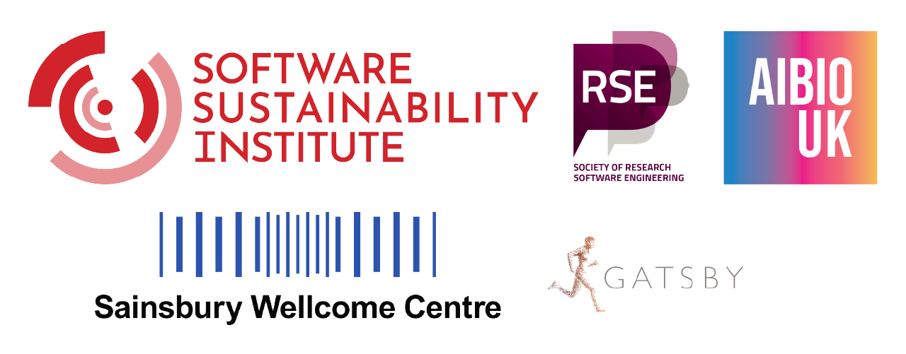

## Preface {.unnumbered}

**Animals in Motion** is an online handbook that introduces free, open-source tools for tracking animal motion from videos and extracting quantitative descriptions of behaviour from motion tracks.

[@sec-versions] of this handbook have been taught as hands-on workshops in the following settings:

- the [Neuroinformatics Unit Open Software Summer School](https://neuroinformatics.dev/open-software-summer-school/index.html)
- the Sainsbury Wellcome Centre's (SWC) [Systems Neurscience PhD Programme](https://www.sainsburywellcome.org/web/content/systems-neuroscience-phd-programme).

Whether you are attending a workshop in person, or following along the materials at your own pace, be sure to check out @sec-prerequisites.

All materials are shared under the [CC-BY-4.0 license](https://github.com/neuroinformatics-unit/course-animals-in-motion/blob/main/LICENSE.md) so you are welcome to use and adapt them for your own workshops.
There is no need to ask for permission, but we'd love to [hear about it](https://neuroinformatics.zulipchat.com/) if you do!
Feedback and contributions to the handbook are always welcome, see @sec-contributing.

## Schedule

The workshop starting on **August 17th, 2026**,
as part of the [Neuroinformatics Unit Open Software Summer School](https://neuroinformatics.dev/open-software-summer-school/index.html),
will cover the following chapters of this handbook:

| Time             | Topics                                        |
|------------------|-----------------------------------------------|
| Day 1: morning   | @sec-intro   @sec-dl-cv                    |
| Day 2: morning   | @sec-sleap                                    |
| Day 2: afternoon | @sec-movement-intro                           |
| Day 3: morning   | @sec-boris   @sec-classification           |
| Day 3: afternoon | @sec-movement-mouse   @sec-movement-zebras |

## Versions {#sec-versions}

The latest release version is always available at the following URL:

<https://animals-in-motion.neuroinformatics.dev/latest/>

To view other versions, replace `latest` in the URL with one of the following version names:

| Version | Description |
| --------- | ------------- |
| [dev](https://animals-in-motion.neuroinformatics.dev/dev/) | development version, corresponding to the `main` branch |
| [v2025.10](https://animals-in-motion.neuroinformatics.dev/v2025.10/)^*^ | version taught as part of the [2025 SWC Systems Neurscience PhD Programme](https://www.sainsburywellcome.org/web/content/systems-neuroscience-phd-programme) |
| [v2025.08](https://animals-in-motion.neuroinformatics.dev/v2025.08/)^*^ | version used during the inaugural [2025 Open Software Week](https://neuroinformatics.dev/open-software-summer-school/2025/index.html). |

^*^*A companion `-answers` build, containing solutions to exercises, is also available for these versions, e.g. [v2025.10-answers](https://animals-in-motion.neuroinformatics.dev/v2025.10-answers/). Solutions are now included at the end of each chapter instead.*

## Funding & acknowledgements

The Open Software Summer School is funded by the [Sainsbury Wellcome Centre](https://www.sainsburywellcome.org/),
the [Society for Research Software Engineering](https://society-rse.org/), [AIBIO-UK](https://aibio.ac.uk/),
and [The Neuro – Irv and Helga Cooper Foundation Open Science Prize](https://www.mcgill.ca/neuro/open-science/open-science-awards-and-prizes/neuro-irv-and-helga-cooper-foundation-open-science-prizes).

The [inaugural 2025 event](https://neuroinformatics.dev/open-software-summer-school/2025/index.html),
which inspired the creation of this handbook, was made possible by a
[Software Sustainability Institute](https://www.software.ac.uk/) fellowship to **Niko Sirmpilatze**

We thank the [Sainsbury Wellcome Centre](https://www.sainsburywellcome.org/)
and the [Gatsby Computational Neuroscience Unit](https://www.ucl.ac.uk/gatsby/gatsby-computational-neuroscience-unit)
for providing facilities for the workshops.

